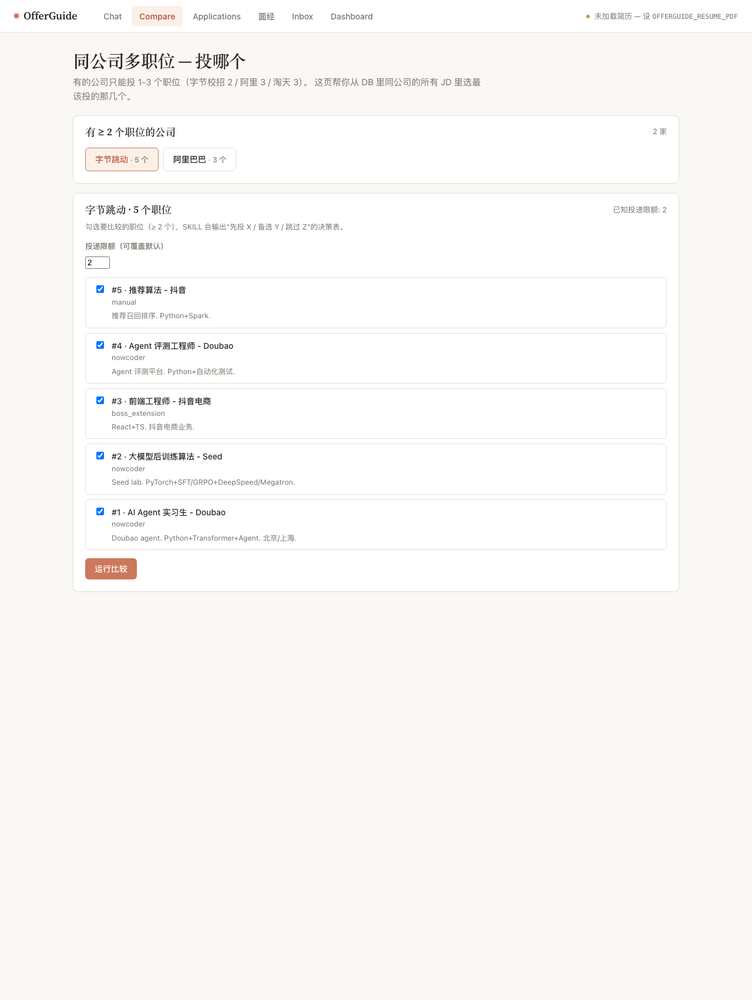
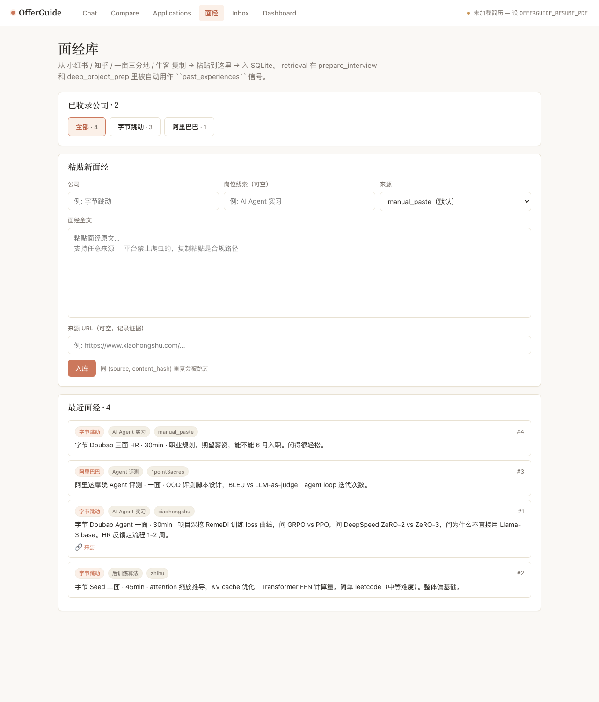
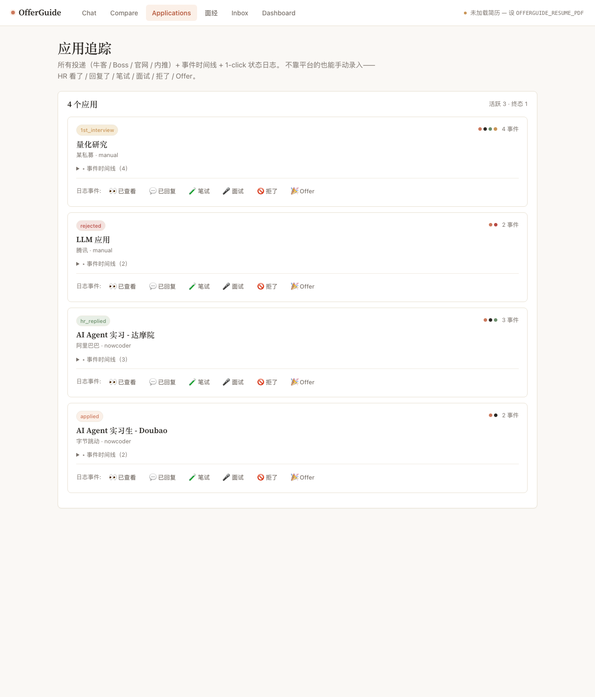

# OfferGuide

**国内校招 Ambient 求职 Copilot + GEPA-style Self-Evolution.**

> 不点投递按钮——做精投决策、投后跟踪、面试备战；用户 dogfood 数据驱动 SKILL 自动进化。


> Claude-inspired warm cream + terracotta + Source Serif 4。截图来自跑活的服务器，不是 mock。

| Compare (同公司多职位投哪个) | 面经库 (小红书/知乎/牛客 paste-in) |
|---|---|
|  |  |

| Applications (1-click 事件追踪) | Chat report (深度项目备战 + 评分 + 差距) |
|---|---|
|  |  |

---

## Why this, and not another auto-applier

业内的 AI 求职 agent ([AIHawk](https://github.com/feder-cr/Jobs_Applier_AI_Agent_AIHawk) 29.7k★、
[ApplyPilot](https://github.com/Pickle-Pixel/ApplyPilot)、
[get_jobs](https://github.com/loks666/get_jobs) 6.8k★ Java) **全是自动投递派**。
但数据显示自动投递是死路：

- **97% 公司用 AI 驱动 ATS** 过滤简历（[来源](https://boterview.com/a/ai-recruitment-statistics)）
- **49% 自动 dismiss AI 写的简历**（[来源](https://www.gettailor.ai/blog/ai-resume-detection)）
- LazyApply Trustpilot **2.1 星 / 52% 最低分**；某用户投 14000 份只收到几百个 skills-mismatch 拒信
  （[来源](https://www.trustpilot.com/review/lazyapply.com)）

OfferGuide 反方向走：**不点投递**，做真正提高 reply rate 的事——精准匹配、定向微调
（不重写）、投后跟踪、面试备战——并用用户自己的 dogfood 数据通过 GEPA **自进化**
agent 的 SKILL prompt。

---

## Architecture

```
┌─────────────────────────────────────────────────────────────────────┐
│                      Conversational Agent (LangGraph)               │
│                                                                     │
│   evolvable SKILLs (Hermes-style SKILL.md):                         │
│     ★ score_match        — 校准过的匹配概率 + 多维 reasoning         │
│     ★ analyze_gaps       — 关键词差距 + 微调建议（带 AI 检测风险）     │
│     ★ prepare_interview  — 公司画像 + 题目预测 + 备战重点              │
│     ★ deep_project_prep  — 项目级深挖：每个项目 5+ 题 + 答题骨架       │
│                            + 弱点应对 + behavioral STAR (W8'')        │
│     ★ compare_jobs       — 同公司多职位投哪个 + 投递限额优化 (W8''')   │
│                                                                     │
│   utility SKILLs:                                                   │
│       update_status     — 应用状态机                                 │
│       query_history     — 历史检索                                   │
└─────────────────┬───────────────────────────────────────────────────┘
                  │
       ┌──────────┴──────────┐
       │                     │
┌──────▼─────┐       ┌───────▼────────┐
│  Workers   │       │  Inbox + UI    │
│            │       │  (HITL queue)  │
│ Scout:     │       │                │
│  · 牛客    │       │ FastAPI + HTMX │
│  · 浏览器  │       │                │
│    扩展    │       │ 飞书 webhook   │
│            │       │ Telegram bot   │
│ Tracker:   │       │                │
│  · 状态机  │       │                │
│  · 沉默检测│       │                │
│  · 7/14/30d│       │                │
└──────┬─────┘       └────────┬───────┘
       │                      │
       └──────────┬───────────┘
                  │
         ┌────────▼────────┐
         │ Memory          │
         │ (local-first)   │
         │                 │
         │ SQLite +        │
         │ sqlite-vec      │
         │                 │
         │ application_    │
         │   events log    │
         │ skill_runs      │
         │ evolution_log   │
         │ inbox_items     │
         └─────────┬───────┘
                   │
        ┌──────────▼─────────────┐
        │ Self-evolution layer   │
        │                        │
        │ DSPy GEPA              │
        │ (ICLR 2026 Oral)       │
        │                        │
        │ Golden trainset        │
        │   + 3-axis metric:     │
        │     · prob in band     │
        │     · keyword recall   │
        │     · anti-FP          │
        │                        │
        │ Writes evolved         │
        │ SKILL.md, parent .bak  │
        │ evolution_log row      │
        └────────────────────────┘
```

### Key design decisions

| Decision | Choice | Why (with source) |
|---|---|---|
| Multi-agent? | **Single LangGraph agent + tools** | [Anthropic](https://claude.com/blog/building-multi-agent-systems-when-and-how-to-use-them): "start simple, multi-agent costs 3-10x tokens" |
| Skill format | **Hermes SKILL.md** (design only, not runtime) | [Hermes Agent](https://github.com/nousresearch/hermes-agent) ICLR 2026 Oral, MIT |
| Self-evolution | **DSPy GEPA** | [GEPA paper](https://arxiv.org/abs/2507.19457) ICLR 2026 Oral; cheap (~$2/run, "auto=light") |
| Vector store | **sqlite-vec** (single-user) | local-first, zero ops; Qdrant overkill at our scale |
| LLM | **DeepSeek V4** main + reflection | OpenAI-compat API, China-friendly |
| Notifier | **飞书 webhook + Telegram bot** dual-rail | Server酱 5 条/天硬限制不够用 |
| HITL | **Inbox queue (SQLite)** rather than `interrupt()` | Async-friendly, easier to reason about |
| Boss 接入 | **浏览器扩展 (Manifest V3, click-to-extract)** | Boss ToS 不允许后台爬，扩展 inject 是合规的；**默认不自动发送** |

---

## Self-evolution loop (the resume pitch in one paragraph)

`score_match / analyze_gaps / prepare_interview / deep_project_prep` **四个** SKILL 都接入了
GEPA 进化基础设施，通过 `evolution/adapters/` 的 adapter 模式插入；加第五个 SKILL 只需
新建 `adapters/<skill>.py` + 注册 REGISTRY。

进化器是 [DSPy GEPA](https://dspy.ai/api/optimizers/GEPA/overview/) (Genetic-Pareto Prompt
Evolution, ICLR 2026 Oral)——no gradient, no fine-tuning, 比 GRPO 强 6-20%, rollout 减少 35x。

每个 adapter 都提供：

1. **手工 golden trainset**（按 SKILL 不同有不同字段）：
   - `score_match`: 10 例，覆盖 fit/misfit/middle 三档（probability_range + must_mention + must_not_mention）
   - `analyze_gaps`: 7 例，real + edge_case 两档（expected_keywords + ai_risk_floor + count range）
   - `prepare_interview`: 6 例，with_面经/no_面经/edge_case 三档（profile_keywords + jd_keywords）
   - `deep_project_prep`: 5 例，real + edge_case（profile_keywords + jd_keywords + expected_min_projects）
2. **多轴 metric**，axes 因 SKILL 而异：
   - `score_match`: 0.5 × prob_in_band + 0.3 × recall + 0.2 × anti_FP
   - `analyze_gaps`: 0.40 × keyword_recall + 0.30 × schema_validity + 0.15 × ai_risk_floor + 0.15 × count_range
   - `prepare_interview`: 0.30 × grounded + 0.25 × category_coverage + 0.20 × schema + 0.15 × calibration_spread + 0.10 × count
   - `deep_project_prep`: 0.20 × schema + 0.20 × type_coverage + 0.20 × rationale_grounded + 0.15 × outline_concreteness + 0.15 × behavioral_specificity + 0.10 × project_count
   每个轴都返回 human-readable feedback 给 GEPA 的 reflection LM
3. **进化产物**——一行 CLI 跑出新版 prompt，写回 `SKILL.md`，旧版自动 `.bak` 备份，
   所有指标 delta 入 `evolution_log` 表

```bash
# 进化任意一个 SKILL（4 个都支持）
$ DEEPSEEK_API_KEY=sk-... python -m offerguide.evolution evolve score_match
$ DEEPSEEK_API_KEY=sk-... python -m offerguide.evolution evolve analyze_gaps
$ DEEPSEEK_API_KEY=sk-... python -m offerguide.evolution evolve prepare_interview --auto medium
$ DEEPSEEK_API_KEY=sk-... python -m offerguide.evolution evolve deep_project_prep --auto medium

# 看进化前后 prompt diff + 指标对比（适合贴博客 / README）
$ python -m offerguide.evolution diff score_match --markdown > evolution.md
```

`diff` 命令输出长这样（这就是简历里 "GEPA 进化前后对比 [TBD-4]" 的可视化证据）：

```markdown
# `score_match` — GEPA Evolution Report

- **Parent version**: `0.2.0`
- **Evolved version**: `0.2.1`

## Metric — total

| baseline | evolved | Δ |
|---|---|---|
| 0.503 | 0.724 | **↑ +0.221** |

## Per-axis breakdown

| axis | baseline | evolved | Δ |
|---|---|---|---|
| anti | 0.500 | 0.612 | +0.112 |
| prob | 0.487 | 0.703 | +0.216 |
| recall | 0.521 | 0.842 | +0.321 |
| total | 0.503 | 0.724 | +0.221 |

## Prompt body diff

```diff
- 你是一名严谨的中文校招求职顾问，背景是统计学。
+ 你是一名严谨的中文校招求职顾问，背景是统计学。**当用户简历明确缺少 JD 列出
+ 的硬性技能时，你必须把这些缺失列入 deal_breakers 而不是仅在 reasoning 里提到**
...
```

---

## Quick start

```bash
# 1. install
pip install -e ".[dev,ui,evolution,scheduling]"

# 2. set up
export DEEPSEEK_API_KEY=sk-...
export OFFERGUIDE_RESUME_PDF=/path/to/your_resume.pdf

# 3. quickstart — exercises every layer through W8 (offline by default)
python examples/quickstart.py /path/to/your_resume.pdf
# add --invoke-skills to actually call the LLM
# add --invoke-agent to also build the LangGraph and run action='everything'

# 4. start the conversational UI
python -m offerguide.ui.web  # http://localhost:8000

# 5. workers (cron candidates)
python -m offerguide.workers tracker run                   # 沉默扫描
python -m offerguide.workers scout nowcoder --limit 50     # 牛客 sitemap

# 6. evolve a SKILL (any of the 3 — adapters/ supports all)
python -m offerguide.evolution evolve score_match --auto light
python -m offerguide.evolution evolve analyze_gaps
python -m offerguide.evolution evolve prepare_interview

# 7. before/after report
python -m offerguide.evolution diff score_match
python -m offerguide.evolution diff score_match --markdown > evolution.md
```

### Boss browser extension

```bash
# Chrome → chrome://extensions → 开发者模式 ON → 加载已解压的扩展程序
#         指向本仓库的 browser_extension/ 目录
```

打开 Boss直聘 JD 页面 → 点击 OfferGuide 扩展图标 → 自动从页面提取（无 content_script，**点了才提取**）
→ 确认 → 发到本地 `http://localhost:8000/api/extension/ingest` → 入 jobs 表。

---

## Repo layout

```
src/offerguide/
├── agent/                # LangGraph 单 agent + state
├── application_events.py # 应用事件日志（W5'）
├── state_machine.py      # event kind → applications.status
├── config.py             # env-driven Settings
├── evolution/
│   ├── cli.py            # python -m offerguide.evolution {evolve,diff}
│   ├── runner.py         # SKILL-agnostic GEPA 编排 (W8' refactor)
│   ├── adapters/         # one module per evolvable SKILL:
│   │   ├── _base.py      #   - generic MetricBreakdown, aggregate
│   │   ├── score_match.py        # 10 examples + 3-axis metric
│   │   ├── analyze_gaps.py       # 7 examples + 4-axis metric
│   │   ├── prepare_interview.py  # 6 examples + 5-axis metric
│   │   └── deep_project_prep.py  # 5 examples + 6-axis metric
│   ├── golden_trainset.py # back-compat shim → adapters/score_match
│   ├── metrics.py        # back-compat shim → adapters/_base + score_match
│   ├── dspy_module.py    # SkillSpec → dspy.Signature
│   └── diff.py           # 进化前后对比报告
├── inbox.py              # HITL 队列
├── interview_corpus.py   # 面经 RAG
├── llm/                  # DeepSeek V4 OpenAI-compat httpx client
├── memory/               # SQLite + sqlite-vec
├── platforms/            # nowcoder / manual / boss_extension
├── profile/              # PDF 简历解析
├── skills/
│   ├── score_match/        ★ evolvable
│   ├── analyze_gaps/       ★ evolvable
│   ├── prepare_interview/  ★ evolvable
│   └── deep_project_prep/  ★ evolvable (项目级深度备战)
├── ui/
│   ├── web.py            # FastAPI + HTMX
│   └── notify/           # 飞书 / Telegram / console
└── workers/
    ├── __main__.py       # python -m offerguide.workers {tracker,scout}
    ├── scout.py          # 牛客 sitemap crawler + ingest
    └── tracker.py        # 沉默检测 + 状态机 + 提醒

browser_extension/        # Manifest V3 Chrome 扩展（Boss 页面提取）
docs/
├── strategy_and_feasibility.md
├── tracking_strategy.md  # 5 个事件信号源 + 当前实现状态（诚实记录）
└── screenshots/
tests/                    # 329 tests, all green
```

---

## Status

- [x] **W1** — scaffold + SKILL.md loader + memory + profile + agent skeleton
- [x] **W2** — Scout v1 (牛客 sitemap, manual paste) + `score_match` SKILL v1
- [x] **W3** — `analyze_gaps` SKILL（带 AI 检测风险标注）
- [x] **W4** — Conversational agent + Inbox + 飞书/Telegram 双轨通知
- [x] **W5'** — application_events 日志 + 严格 SKILL 输入规范化 + extras_json 修复
- [x] **W6** — GEPA 进化基础设施（11-case golden trainset + 3-axis metric + DSPy 模块 + writeback CLI）
- [x] **W7** — Tracker worker（应用状态机 + 7/14/30d 沉默检测）+ Boss 浏览器扩展 v1
- [x] **W8** — `prepare_interview` SKILL + `evolution diff` CLI + README 重写
- [x] **W8'** — Generalize GEPA to all 3 SKILLs (adapter pattern); wire `prepare_interview`
       into the agent (`graph.py` prep_node + `interview_corpus` retrieval); workers CLI
- [x] **W8''** — UI 大改 (Claude-inspired warm cream + Source Serif 4 headings),
       new `/applications` page with 1-click event logging, **新 SKILL `deep_project_prep`**
       (4th evolvable SKILL): per-project deep-dive prep with answer outlines + weak-point
       mitigation + tailored behavioral questions; `docs/tracking_strategy.md` 诚实记录
       5 个信号源的实现状态
- [x] **W8'''** — 投递组合优化 + 真实 HR 信号路径：**新 SKILL `compare_jobs`** (5th
       evolvable SKILL) + `/compare` 页面，按公司投递限额（字节校招硬限 2 / 阿里 3 /
       淘天 3 / 等真实 policy）做横向比较 → "先投 X / 备选 Y / 跳过 Z" 决策表；
       `email_classifier` paste-in 邮件分类器（无 IMAP，不碰隐私）；`ics_parser` ICS
       日历上传 → 自动 record interview 事件 + scheduled_at；`/interviews` 面经库 paste
       UI（小红书 / 知乎 / 一亩三分地 / 牛客 discuss 全 source）
- [x] **W8''''** — Agentic layer 替换关键词匹配：**`agentic/email_classifier_llm.py`**
       DeepSeek-V4 驱动的邮件分类器，从邮件中提取结构化信息 (interview_time / contact_name
       / interview_round / assessment_link)，**取代了之前那个垃圾 regex**；
       **`agentic/corpus_collector.py`** 真 agent — 用 search backend (DuckDuckGo HTML 默认)
       搜面经 + LLM 评估质量 + 自动 ingest，用户不用再手 paste；`agentic/meta_agent.py`
       company-sweep orchestrator + `POST /api/agent/sweep` 端点
- [x] **W8'''''** — **真自治 (autonomous daemon)**：**`autonomous/`** 用 APScheduler 跑 cron-style
       触发：`silence_check` (daily 09:00) / `corpus_refresh` (weekly Mon 08:00) /
       `brief_update` (daily 23:00)。**`company_briefs` 表 + `briefs.refresh_brief()`**
       — agent 读最近面经/事件/JD → DeepSeek 合成 brief → 覆盖硬编码 `COMPANY_APPLICATION_LIMITS`
       (high-confidence 时)。**`effective_app_limit()`** 是 brief vs hardcoded 的统一入口。
       Run as daemon: `python -m offerguide.autonomous run`，或 cron 友好的
       `run-once <job>`。设计 borrowed from APScheduler / OpenHands / LangChain — 见
       [ATTRIBUTION.md](ATTRIBUTION.md)
- [ ] **dogfood** — 4 周持续投递收集真实 reply rate 数据；跑首次 GEPA 真活；填 `[TBD]` 数字

### What's still TBD（需 dogfood 数据）

- [TBD-1] 真实 reply rate baseline (W1-W2) vs 进化后 (W3+)
- [TBD-2] 面试题命中率（prepare_interview 预测 vs 实际）
- [TBD-3] match_score 校准曲线（calibrated probability vs 实际 reply rate）
- [TBD-4] **进化前后 prompt diff** —— `python -m offerguide.evolution diff score_match`
  跑出来贴在这里
- [TBD-5] 单次 GEPA 运行成本（预计 $2-10）

---

## What's LLM, what's heuristic — honest table

OfferGuide 是个混合系统。哪些组件**真用 LLM**，哪些只是**确定性规则**：

| 组件 | 路径 | 为什么 |
|---|---|---|
| 5 个 evolvable SKILL (`score_match` / `analyze_gaps` / `prepare_interview` / `deep_project_prep` / `compare_jobs`) | ✅ DeepSeek-V4 via httpx | 这些任务**需要理解上下文**，规则做不到 |
| `agentic/email_classifier_llm.py` (W8'''') | ✅ DeepSeek-V4 | 邮件理解需要 context；regex 会把"感谢您面试"在拒信里误判成 interview |
| `agentic/corpus_collector.py` (W8'''') | ✅ DeepSeek-V4 + WebSearch backend | 每个候选页面用 LLM 评估"是不是真面经 / 哪一年 / 哪个岗位"，是真 agency |
| `email_classifier.py` (regex) | ⚠️ 25 个 regex pattern | 保留作为 **no-API-key fallback**——`/api/email/classify?mode=auto` 在没设 `DEEPSEEK_API_KEY` 时用它，设了就走 LLM |
| `tracker.py` (沉默检测 7/14/30d) | ✅ 规则 (合适) | 时间窗口判断不需要 LLM，规则更可控 |
| `ics_parser.py` (ICS 文件解析) | ✅ 规则 (合适) | 解析 RFC 5545 结构化格式，规则就够 |
| `state_machine.py` (event → applications.status) | ✅ 规则 (合适) | 离散状态映射，规则更可读 |
| `scout.py` (牛客 sitemap crawler) | ✅ 规则 (合适) | HTML 解析 + httpx，crawler 本来就是 reactive |
| Boss 浏览器扩展 JD 提取 | ✅ DOM selector | DOM extraction，规则合适 |
| `evolution/` GEPA SKILL prompt 进化 | ✅ DSPy GEPA + DeepSeek 反思 LM | meta-evolution layer |

**还没做但应该做**（W9 候选）：
- Boss 扩展加事件抓取（已查看 / 站内信 → 自动 record events）
- 自进化的 `company_briefs` 表（agent 观察最近面经/新闻 → 推断公司当前状态，覆盖硬编码 limit 表）
- 真 meta-agent 决策循环（自己决定何时 sweep 哪家公司、何时去拉新面经）

## License

MIT. See [ATTRIBUTION.md](ATTRIBUTION.md) — OfferGuide 借鉴 Hermes Agent 的 SKILL.md 设计、
使用 DSPy GEPA 进化算法，均 MIT。
