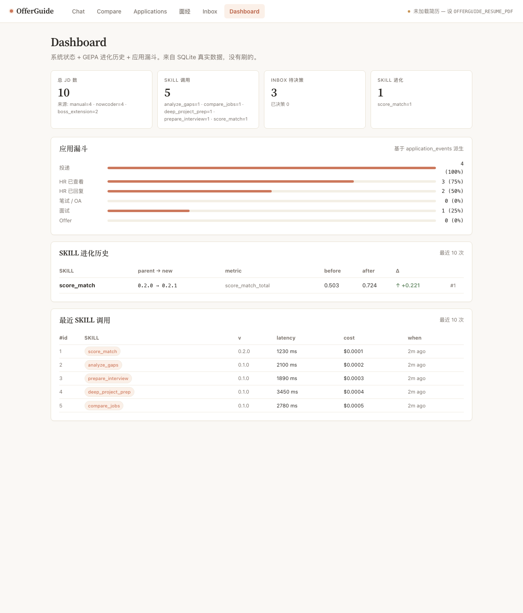
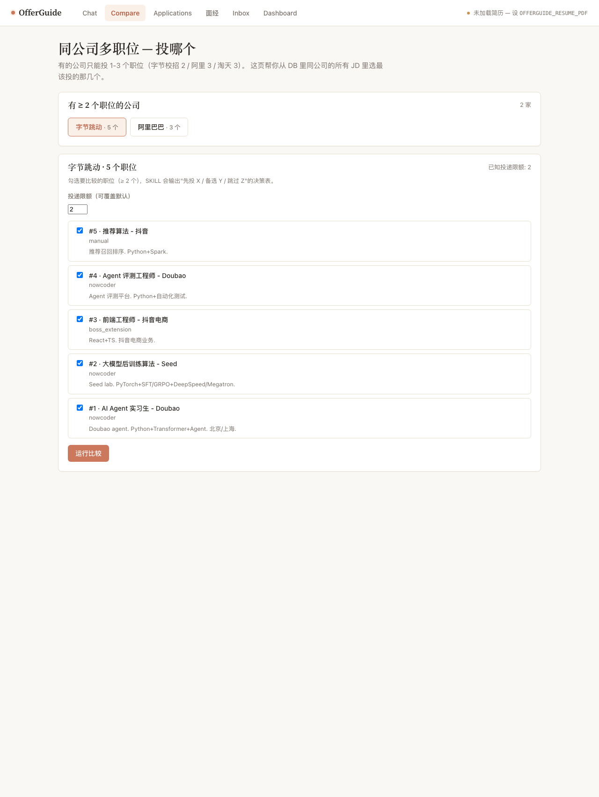
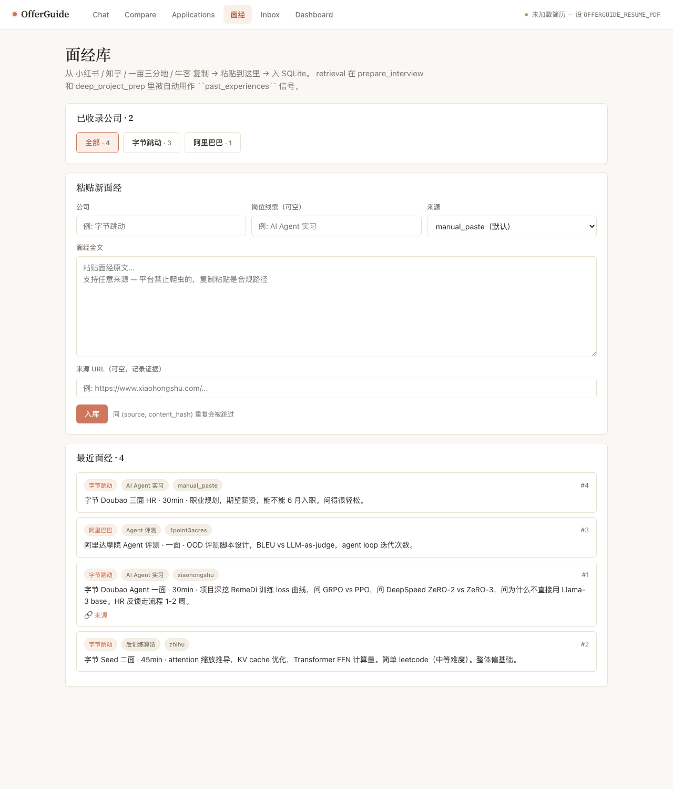
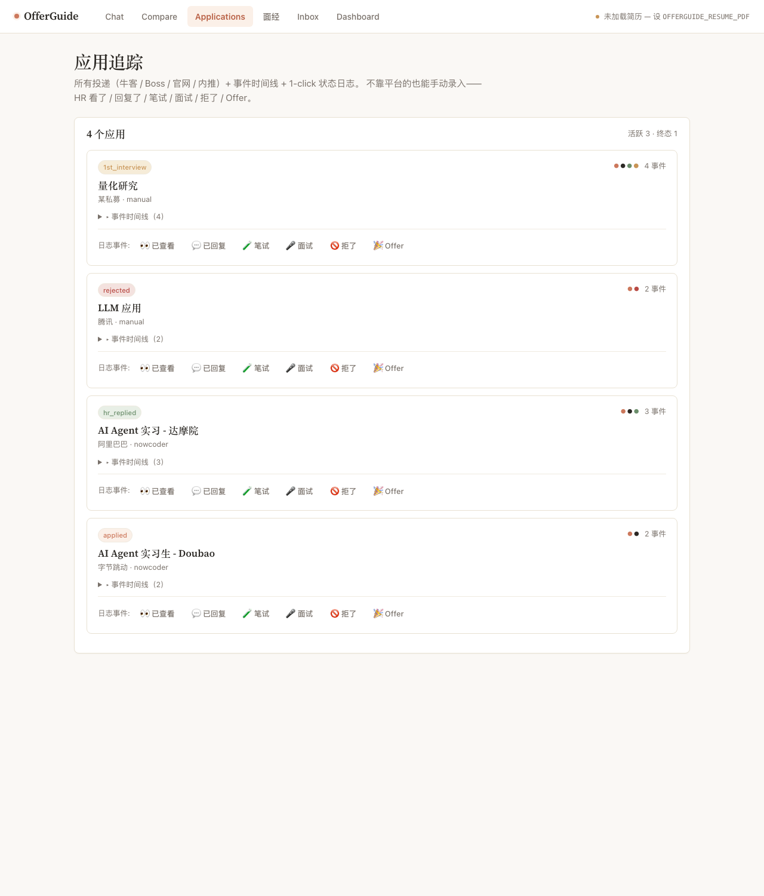
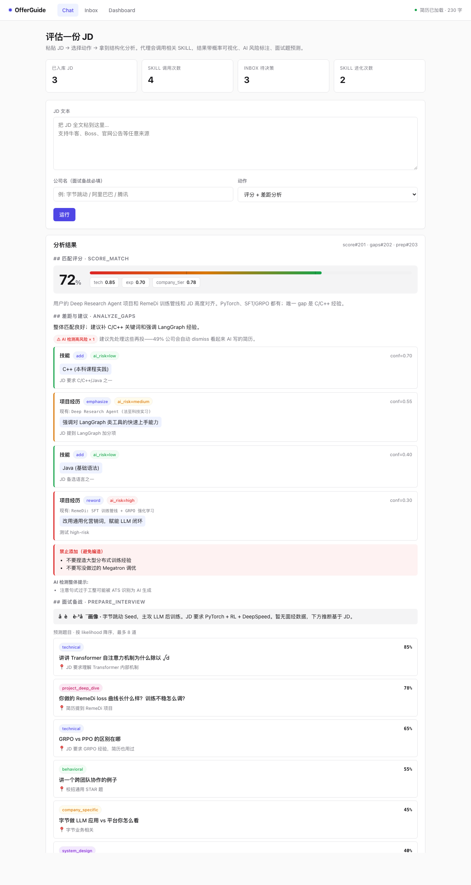

# OfferGuide

**国内校招 Ambient 求职 Agent — 反 auto-applier 路线, 做 search / draft / track, 决策留给你.**

> **不是 LangChain wrapper, 不是 Manus 复刻, 不是 ChatGPT 代写简历**. 借鉴
> Anthropic *Effective Harnesses for Long-Running Agents* 的真实 primitives
> （default-fail contract / fresh evaluator / progress handoff）+ Cognition Devin
> 的 ambient design, 国内校招特化.

## 为什么是这个项目

业内 AI 求职 agent 全在做"自动投递", 数据说这条路死了:

- **AIHawk** (29.6k★) **2026/4 被作者归档**, 转商业化
- **get_jobs** (6.8k★ Java) **2024 末停更** — 反爬军备升级跑赢脚本
- **LazyApply** Trustpilot **2.1 星 / 52% 1 星**, 用户投 14000 份只收到几百个 skills-mismatch 拒信
- **国内代投中介卖课 8999-12999** 被人民日报点名

数据对比:
- 自动投递 reply rate **< 2%**
- 精投 reply rate **10-15%**
- 国内字节一年只能投 2 次 — **false-positive 成本不可逆**

OfferGuide 反方向走: **不替你点投递, 帮你投得更准**.

## 3 个 design decision (跟同质 agent 项目的核心差异)

### 1. 真实 Anthropic-style harness primitives, 拒绝一轮式 Agent

LangChain agents 是 reactive turn loops + chains, 短任务还行, 求职是长跑场景 — 7 天后回来查回应, agent 不能每次重头读 history. 所以:

- **Default-fail contract** — `test-results.json` 里每个项目默认 `passes: false`, 没证据不能改成通过
- **Fresh-context evaluator** — `.claude/agents/evaluator.md` 只读检查 diff + evidence, 不让 builder 自评
- **Agent-maintained handoff** — `PROGRESS.md` 记录进度/证据/下一步, 下一轮从冷上下文继续
- **OfferGuide application loop** — `src/offerguide/harness/` 是产品内 agent loop: chat / tools / memory / scheduled wake

### 2. 不替用户决策, 国内 false-positive 成本不可逆

> "字节一年 2 次投递机会. 你瞎投一个就没了."

所以 AI 用在 **search / draft / track**, decision 留给用户. 这是**风险工程判断** — false-positive 成本不可逆的场景, 不该把决策让给概率模型.

### 3. 保 .docx 段落 style 简历微调 (国内 Word 网投独有)

career-ops 是 markdown→PDF 重排 — 海外 Greenhouse / Lever 流程对.
国内 ATS 看 .docx, 段落 style (Times New Roman / 字号 / 加粗) 全保留是必须. **国内没有第二个 OSS 项目做这件事**.

加上 W15.17 的"InsertedClaim + prep_plan": agent 给你简历加的每个新 claim 都配 5-7 天学习清单 (论文 / demo / 5 道高频题 / fallback). **把"虚假"变"真学习"** — 面试被问到 RAG 时你真的会答, 因为 5 天前你读了 paper.

## Status

> **Technical spike, currently dogfooding** for my own 2026 暑期实习 search since **May 9, 2026**.
>
> 第 1 周数据 (每周更新):
> - 评估 JD: ___
> - 投递: ___
> - BOSS 回应 / 面试: ___
> - 累计 LLM cost: $___
>
> 详见 [`docs/dogfood_log.md`](docs/dogfood_log.md). 完整面试准备包: [`docs/resume_pitch_kit.md`](docs/resume_pitch_kit.md).

## Quick start

**已经在 conda env / venv 里**:

```bash
python -m offerguide.ui.web
# → http://127.0.0.1:8000
```

**全新机器**:

```bash
git clone https://github.com/huy555huy/OfferGuide.git && cd OfferGuide
./install.sh        # 自动检测 conda / venv / uv, 用最少摩擦的路径装
# .env 编辑: OFFERGUIDE_LLM_API_KEY="sk-..." + OFFERGUIDE_RESUME_PDF=".../简历.docx"
python -m offerguide.ui.web
```

→ home 顶部 hero #1 "🎯 这家公司值不值得投" 粘 JD → 10-20s 出报告 + 简历建议.

**Chrome 浏览器扩展** (BOSS 推荐池一键 sync): 加载 `browser_extension/` 到 `chrome://extensions/`.



> Claude-inspired warm cream + terracotta + Source Serif 4。截图来自跑活的服务器，不是 mock。

| Compare (同公司多职位投哪个) | 面经库 (小红书/知乎/牛客 paste-in) |
|---|---|
|  |  |

| Applications (1-click 事件追踪) | Chat report (深度项目备战 + 评分 + 差距) |
|---|---|
|  |  |

---

## Why this, and not another auto-applier

业内的 AI 求职 agent ([AIHawk](https://github.com/feder-cr/Jobs_Applier_AI_Agent_AIHawk) 原 29.6k★ — **作者 2026/4 已归档**、
[ApplyPilot](https://github.com/Pickle-Pixel/ApplyPilot)、
[get_jobs](https://github.com/loks666/get_jobs) 6.8k★ Java — **2024 末停更**) **全是自动投递派**。
数据显示这条路在走死：

- 头部自动投递工具陆续退场：AIHawk 归档、get_jobs 停更、LazyApply 拿 Trustpilot **2.1 星 / 52% 最低分**
  （[来源](https://www.trustpilot.com/review/lazyapply.com)）
- **海外** 简历 ATS 使用率 ~97%（[来源](https://boterview.com/a/ai-recruitment-statistics)），
  **国内** 大厂调研估测 60-70%（无权威公开数据，主要走"AI 初筛建议 + HR 终判"模式）
- 海外 ATS 数据：**49% 自动 dismiss AI 写的整篇简历**（[来源](https://www.gettailor.ai/blog/ai-resume-detection)）
  ——国内同等数据未见公开，但定向微调 vs 整篇重写的差距在中文 docx 上同样存在

OfferGuide 反方向走：**不点投递**，做真正提高 reply rate 的事——精准匹配、定向微调
（保留 docx 段落 style，**只改 wording / order / emphasis**, 不写未发生的经历）、投后跟踪、
面试备战——并用用户自己的 dogfood 数据通过 GEPA **自进化** agent 的 SKILL prompt。

> 几个数字要诚实标注: README 里关于"国内字节硬限 2 / 阿里 3 个意向"等 comparison
> 决策依据，**多数是社区流传说法不是官方文档**。OfferGuide 把这些标记为
> "estimated, source: community"（详见 `effective_app_limit()`），用户自己的真实
> 面经会逐步覆盖这些猜测。简历定稿前会用真 dogfood 数据替换 [TBD] 占位。

---

## Architecture (W21 — agent-first)

```
        ┌─────────────────────────────────────────────────────────────┐
        │  application agent loop (src/offerguide/harness, W15)       │
        │  "dumb on purpose; coordinates Claude's decisions,          │
        │   doesn't make them" — agency is in-context, not in code   │
        │                                                             │
        │  trigger (cron / event / user_input / scheduled)            │
        │      → ContextManager (compaction, tool-result clearing)    │
        │      → LLM with 17 main-agent tools                         │
        │      → execute tools sequentially → loop until end_turn     │
        │                                                             │
        │  17 tools (instructions.md): memory · score_match ·         │
        │  tailor_advice · notify_user · ask_user · interview_prep ·  │
        │  reflect_outcome · fetch_jd · web_search · fetch_url ·      │
        │  record_event · schedule_next_wake · discover_jobs ·        │
        │  search_official_jobs · detect_evolution_candidates ·       │
        │  evolve_skill · run_release_cycle                           │
        └────────────────┬────────────────────────────────────────────┘
                         │
       ┌─────────────────┼─────────────────────────┐
       │                 │                         │
┌──────▼──────────┐ ┌────▼────────────┐  ┌────────▼──────────────────┐
│ W21 SubAgents   │ │ evolvable SKILLs│  │ ambient discovery (W15.23)│
│ (delegate_*)    │ │ (Hermes-style)  │  │ 4 parallel stages each    │
│                 │ │                 │  │ cycle:                    │
│ DiscoverySub —  │ │ score_match     │  │  · nowcoder sitemap       │
│  9 verified     │ │ analyze_gaps    │  │  · 0voice GitHub repo     │
│  fetchers       │ │ apply_assistant │  │    aggregator             │
│  (nowcoder /    │ │ tailor_resume   │  │  · verified_official      │
│   腾讯校招 + 社招│ │ prepare_interv. │  │    (腾讯/百度/字节)       │
│   / 百度校招 +   │ │ mock_interview  │  │  · 实习僧                 │
│   实习 / 字节 /  │ │ deep_project... │  │                           │
│   0voice /      │ │ compare_jobs    │  │ Pre-ingest filter:         │
│   实习僧)        │ │ apply_assistant │  │  scout._is_obviously_      │
│                 │ │ ... 11 total    │  │  offtopic (蓝领/销售)      │
│ EvaluationSub —  │ │                 │  └───────────────────────────┘
│  6 SKILL        │ │                 │
│  wrappers       │ │                 │
└─────────────────┘ └────────┬────────┘
                             │
                ┌────────────▼──────────────────────┐
                │  closed-loop evolution (W13.1)    │
                │                                   │
                │  signals (3 real-feedback only):  │
                │   · user_thumbs   (UI 👍/👎)      │
                │   · app_outcome   (offer/reject)  │
                │   · follow_through (acted?)       │
                │     — LLM self-critique retired,  │
                │       it's reflexively biased     │
                │                                   │
                │  → fitness.compute_fitness        │
                │  → detect_evolution_candidates    │
                │     (agent calls as a tool)       │
                │  → evolve_skill → shadow row      │
                │  → run_release_cycle: shadow →    │
                │    canary (traffic split) → live  │
                │  → SkillRuntime.invoke routes per │
                │    skill_variants table           │
                └───────────────────────────────────┘

Persistence (single SQLite file, sqlite-vec for embeddings):
  jobs · applications · harness_runs · harness_events · harness_scheduled_wakes
  skill_runs · skill_variants · evolution_signals · user_keywords · inbox_items
  user_facts (mem0-style)
```

### Key design decisions

| Decision | Choice | Why (with source) |
|---|---|---|
| Agent topology | **Single application agent loop** (W15) + **W21 SubAgent** for specialized domains | [Anthropic agent guide](https://www.anthropic.com/research/building-effective-agents): "single agent, agency in-context, no planner/executor/reflector chain"; sub-agent pattern from [Hermes Agent](https://github.com/nousresearch/hermes-agent) `delegate_tool.py` |
| Long-running harness | **Anthropic CWC primitives**: `test-results.json`, `PROGRESS.md`, `.claude/hooks/*`, `.claude/agents/evaluator.md` | [Effective Harnesses for Long-Running Agents](https://www.anthropic.com/engineering/effective-harnesses-for-long-running-agents): default-fail contract, fresh-context evaluator, agent-maintained handoff |
| Skill format | **Hermes SKILL.md** (design + variant runtime) | [Hermes Agent](https://github.com/nousresearch/hermes-agent) ICLR 2026 Oral, MIT |
| Self-evolution | **Closed-loop GEPA-style** (3 real-feedback signal channels, no LLM self-critique) | LLM-self-eval is reflexively biased; signals come from user 👍/👎 + app outcome + follow-through. [GEPA paper](https://arxiv.org/abs/2507.19457) is the algorithm reference |
| Vector store | **sqlite-vec** (single-user) | local-first, zero ops; Qdrant overkill at our scale |
| LLM | **DeepSeek V4** | OpenAI-compat API, China-friendly; daily $5 budget cap |
| Notifier | **飞书 webhook + Telegram bot** dual-rail | Server酱 5 条/天硬限制不够用 |
| HITL | **Inbox queue (SQLite)** rather than `interrupt()` | Async-friendly, easier to reason about |
| Boss 接入 | **浏览器扩展 (Manifest V3, click-to-extract)** | Boss ToS 不允许后台爬，扩展 inject 是合规的；**默认不自动发送** |

---

## Self-evolution loop (the resume pitch in one paragraph)

`score_match / analyze_gaps / prepare_interview / deep_project_prep` **四个** SKILL 都接入了
GEPA 进化基础设施，通过 `evolution/adapters/` 的 adapter 模式插入；加第五个 SKILL 只需
新建 `adapters/<skill>.py` + 注册 REGISTRY。

进化器是 [DSPy GEPA](https://dspy.ai/api/optimizers/GEPA/overview/) (Genetic-Pareto Prompt
Evolution, ICLR 2026 Oral)——no gradient, no fine-tuning, 比 GRPO 强 6-20%, rollout 减少 35x。

每个 adapter 都提供：

1. **手工 golden trainset**（按 SKILL 不同有不同字段）：
   - `score_match`: 10 例，覆盖 fit/misfit/middle 三档（probability_range + must_mention + must_not_mention）
   - `analyze_gaps`: 7 例，real + edge_case 两档（expected_keywords + ai_risk_floor + count range）
   - `prepare_interview`: 6 例，with_面经/no_面经/edge_case 三档（profile_keywords + jd_keywords）
   - `deep_project_prep`: 5 例，real + edge_case（profile_keywords + jd_keywords + expected_min_projects）
2. **多轴 metric**，axes 因 SKILL 而异：
   - `score_match`: 0.5 × prob_in_band + 0.3 × recall + 0.2 × anti_FP
   - `analyze_gaps`: 0.40 × keyword_recall + 0.30 × schema_validity + 0.15 × ai_risk_floor + 0.15 × count_range
   - `prepare_interview`: 0.30 × grounded + 0.25 × category_coverage + 0.20 × schema + 0.15 × calibration_spread + 0.10 × count
   - `deep_project_prep`: 0.20 × schema + 0.20 × type_coverage + 0.20 × rationale_grounded + 0.15 × outline_concreteness + 0.15 × behavioral_specificity + 0.10 × project_count
   每个轴都返回 human-readable feedback 给 GEPA 的 reflection LM
3. **进化产物**——一行 CLI 跑出新版 prompt，写回 `SKILL.md`，旧版自动 `.bak` 备份，
   所有指标 delta 入 `evolution_log` 表

```bash
# 进化任意一个 SKILL（4 个都支持）
$ DEEPSEEK_API_KEY=sk-... python -m offerguide.evolution evolve score_match
$ DEEPSEEK_API_KEY=sk-... python -m offerguide.evolution evolve analyze_gaps
$ DEEPSEEK_API_KEY=sk-... python -m offerguide.evolution evolve prepare_interview --auto medium
$ DEEPSEEK_API_KEY=sk-... python -m offerguide.evolution evolve deep_project_prep --auto medium

# 看进化前后 prompt diff + 指标对比（适合贴博客 / README）
$ python -m offerguide.evolution diff score_match --markdown > evolution.md
```

`diff` 命令输出长这样（这就是简历里 "GEPA 进化前后对比 [TBD-4]" 的可视化证据）：

```markdown
# `score_match` — GEPA Evolution Report

- **Parent version**: `0.2.0`
- **Evolved version**: `0.2.1`

## Metric — total

| baseline | evolved | Δ |
|---|---|---|
| 0.503 | 0.724 | **↑ +0.221** |

## Per-axis breakdown

| axis | baseline | evolved | Δ |
|---|---|---|---|
| anti | 0.500 | 0.612 | +0.112 |
| prob | 0.487 | 0.703 | +0.216 |
| recall | 0.521 | 0.842 | +0.321 |
| total | 0.503 | 0.724 | +0.221 |

## Prompt body diff

```diff
- 你是一名严谨的中文校招求职顾问，背景是统计学。
+ 你是一名严谨的中文校招求职顾问，背景是统计学。**当用户简历明确缺少 JD 列出
+ 的硬性技能时，你必须把这些缺失列入 deal_breakers 而不是仅在 reasoning 里提到**
...
```

---

## Quick start

```bash
# 1. install
pip install -e ".[dev,ui,evolution,scheduling]"

# 2. set up
export DEEPSEEK_API_KEY=sk-...
export OFFERGUIDE_RESUME_PDF=/path/to/your_resume.pdf

# 3. start the agent + UI (this is the main entrypoint)
python -m offerguide.ui.web  # http://localhost:8000
# spawns the FastAPI app, the ambient discovery background task (4 stages
# fetching nowcoder / 0voice / verified官方 / 实习僧), and the cron-style
# scheduler that pokes the harness every hour. Set OFFERGUIDE_NO_SCHEDULER=1
# to disable the in-process scheduler (e.g. during dev / debug).

# 4. workers (independent CLIs)
python -m offerguide.workers tracker run                   # 沉默扫描
python -m offerguide.workers scout nowcoder --limit 50     # 牛客 sitemap

# 5. trigger the harness once (cron-equivalent, no UI needed)
python -m offerguide.autonomous run-once

# 6. evolve a SKILL on demand (normally the agent does this itself when
#    it sees fitness < threshold; this is the manual override)
#    UI equivalent: /evolution page → "立即进化" button
curl -X POST http://localhost:8000/api/evolution/evolve/score_match
```

### Boss browser extension (v0.3 — 半自动求职)

```bash
# Chrome → chrome://extensions → 开发者模式 ON → 加载已解压的扩展程序
#         指向本仓库的 browser_extension/ 目录
```

3 个使用方式（**OfferGuide 不替你按发送，半自动**）：

1. **JD 详情页自动评分** — 打开 BOSS `job_detail/...` 页面，content_script
   自动抓 JD → 调 OfferGuide → 右上角浮窗显示 score + 关键 gap（3-8s）。
2. **一键写开场白** — 浮窗里点 `📋 写开场白` → 5-10s 后开场白自动复制到剪贴板，
   `Cmd+V` 到 BOSS 沟通框 → **自己审核 + 改抬头 → 自己点发送**。
3. **推荐池一键 sync** — 在 BOSS 推荐 / 搜索列表页点扩展图标 → 整页 N 个岗位
   bulk 入库 → agent 后台评分排序。

后端必须先起着 (`python -m offerguide.ui.web`)，浮窗才有响应。

---

## Repo layout

```
.claude/                    # Anthropic CWC long-running harness primitives
├── CLAUDE.md               # handoff + one-feature-at-a-time convention
├── settings.json           # PreToolUse / Stop hook wiring
├── agents/evaluator.md     # fresh-context skeptical evaluator
└── hooks/                  # kill-switch, steer, evidence gate, stop commit
PROGRESS.md                 # agent-maintained handoff
test-results.json           # default-fail contract; evidence required before pass

src/offerguide/
├── harness/              # W15 application agent loop — chat/tools/memory/wakes
│   ├── loop.py           #   worldview, agency in-context
│   ├── tools.py          #   17 main-agent tools (single registry via
│   │                     #   _MAIN_TOOL_ENTRIES — schema + dispatch both
│   │                     #   derive from one source)
│   ├── instructions.md   #   agent's "soul prompt" (190 lines)
│   ├── context.py        #   ContextManager: compaction + tool-result clearing
│   ├── memory.py         #   MemoryStore: 6-command tool over .offerguide/worldview/*.md
│   ├── triggers.py       #   cron / event / scheduled / user_input
│   └── evaluate.py       #   fast paste-JD path (skips agent loop)
├── agents/               # W21 SubAgent base + Discovery + Evaluation
│   ├── base.py           #   bounded ReAct loop scoped to one tool group
│   ├── discovery.py      #   delegate_discovery — 9 verified fetchers
│   └── evaluation.py     #   delegate_evaluation — 6 SKILL wrappers
├── tools/                # W21 ToolRegistry (singleton, self-registering)
│   ├── registry.py
│   ├── discovery.py      #   fetch_{nowcoder,tencent_*,baidu_*,bytedance,
│   │                     #   zerovoice,shixiseng} + read_last_fetch_times
│   └── evaluation.py     #   score_job / generate_apply_pack / tailor_resume /
│                         #   find_resume_gaps / compare_jobs / read_job (shared)
├── skills/               # 11 Hermes-style SKILL.md units (evolvable)
│   ├── score_match/      ★ calibrated match probability
│   ├── tailor_resume/    ★ JD-specific resume (anti-fabrication)
│   ├── apply_assistant/  ★ application Q&A + intro script
│   ├── prepare_interview/★ interview prep pack
│   ├── analyze_gaps/     ★ resume gap analysis
│   ├── mock_interview/   ★ multi-turn mock
│   ├── deep_project_prep/★ per-project deep dive
│   ├── compare_jobs/     ★ multi-job per-company comparison
│   ├── post_interview_reflection/  ★
│   ├── profile_resume_gap/         ★
│   ├── successful_profile/         ★
│   ├── write_cover_letter/         ★
│   ├── _runtime.py       #   SkillRuntime: invoke + use_cache + variant routing
│   ├── _loader.py        #   SKILL.md → SkillSpec
│   └── _spec.py
├── evolution/            # Closed-loop GEPA-style SKILL evolution (W13.1)
│   ├── signals.py        #   record_user_thumbs / record_app_outcome /
│   │                     #   record_follow_through (3 real-feedback channels)
│   ├── fitness.py        #   compute_fitness / detect_evolution_candidates
│   ├── evolve.py         #   evolve_skill (generate N variants as shadow rows)
│   ├── registry.py       #   skill_variants lifecycle (shadow → canary → live)
│   └── release.py        #   run_release_cycle (gray-release pipeline)
├── workers/
│   ├── ambient.py        #   W15.23 background discovery loop (4 stages)
│   ├── scout.py          #   nowcoder ingest + offtopic title filter
│   └── tracker.py        #   silence detection + status machine
├── agentic/              # LLM-backed utility helpers (NOT agents — name
│   ├── corpus_collector.py     # legacy; left for compat)
│   ├── email_classifier_llm.py #   面经 search + ingest
│   ├── company_sweep.py        #   procedural company sweep (was meta_agent.py)
│   └── search.py               #   Tavily backend
├── autonomous/           # APScheduler cron entry — single 'wake_agent' job
│   └── scheduler.py      #   每小时 (08-22) poll pending triggers / heartbeat
├── ui/
│   ├── web.py            # FastAPI + HTMX (~5300 lines, in-process scheduler)
│   └── notify/           # 飞书 / Telegram / console
├── user_keywords.py      # W21 user-managed include/exclude keyword store
├── _markdown.py          # Internal markdown helper (was context_engine.py;
│                         # renamed when we noticed the old name shopped the
│                         # term "context engineering" but didn't actually do any)
├── application_plan.py   # Per-platform application path enum (verified URLs)
├── recruit_type.py       # Deterministic 暑期/日常/校招/社招 classifier
├── inbox.py              # HITL queue
├── interview_corpus.py   # 面经 RAG
├── llm/                  # DeepSeek V4 OpenAI-compat httpx client + budget cap
├── memory/               # SQLite + sqlite-vec
├── platforms/            # nowcoder / manual / boss_extension / official_jobs /
│                         #   zerovoice / shixiseng
├── profile/              # PDF / docx resume parsing
└── goals.py              # north-star goal + progress (heuristic on_track)

browser_extension/        # Manifest V3 Chrome 扩展（Boss 页面提取）
docs/
├── strategy_and_feasibility.md
├── tracking_strategy.md  # 5 个事件信号源 + 当前实现状态（诚实记录）
└── screenshots/
tests/                    # 329 tests, all green
```

---

## Status

- [x] **W1** — scaffold + SKILL.md loader + memory + profile + agent skeleton
- [x] **W2** — Scout v1 (牛客 sitemap, manual paste) + `score_match` SKILL v1
- [x] **W3** — `analyze_gaps` SKILL（带 AI 检测风险标注）
- [x] **W4** — Conversational agent + Inbox + 飞书/Telegram 双轨通知
- [x] **W5'** — application_events 日志 + 严格 SKILL 输入规范化 + extras_json 修复
- [x] **W6** — GEPA 进化基础设施（11-case golden trainset + 3-axis metric + DSPy 模块 + writeback CLI）
- [x] **W7** — Tracker worker（应用状态机 + 7/14/30d 沉默检测）+ Boss 浏览器扩展 v1
- [x] **W8** — `prepare_interview` SKILL + `evolution diff` CLI + README 重写
- [x] **W8'** — Generalize GEPA to all 3 SKILLs (adapter pattern); wire `prepare_interview`
       into the agent (`graph.py` prep_node + `interview_corpus` retrieval); workers CLI
- [x] **W8''** — UI 大改 (Claude-inspired warm cream + Source Serif 4 headings),
       new `/applications` page with 1-click event logging, **新 SKILL `deep_project_prep`**
       (4th evolvable SKILL): per-project deep-dive prep with answer outlines + weak-point
       mitigation + tailored behavioral questions; `docs/tracking_strategy.md` 诚实记录
       5 个信号源的实现状态
- [x] **W8'''** — 投递组合优化 + 真实 HR 信号路径：**新 SKILL `compare_jobs`** (5th
       evolvable SKILL) + `/compare` 页面，按公司投递限额（字节校招硬限 2 / 阿里 3 /
       淘天 3 / 等真实 policy）做横向比较 → "先投 X / 备选 Y / 跳过 Z" 决策表；
       `email_classifier` paste-in 邮件分类器（无 IMAP，不碰隐私）；`ics_parser` ICS
       日历上传 → 自动 record interview 事件 + scheduled_at；`/interviews` 面经库 paste
       UI（小红书 / 知乎 / 一亩三分地 / 牛客 discuss 全 source）
- [x] **W8''''** — Agentic layer 替换关键词匹配：**`agentic/email_classifier_llm.py`**
       DeepSeek-V4 驱动的邮件分类器，从邮件中提取结构化信息 (interview_time / contact_name
       / interview_round / assessment_link)，**取代了之前那个垃圾 regex**；
       **`agentic/corpus_collector.py`** 真 agent — 用 search backend (DuckDuckGo HTML 默认)
       搜面经 + LLM 评估质量 + 自动 ingest，用户不用再手 paste；`agentic/meta_agent.py`
       company-sweep orchestrator + `POST /api/agent/sweep` 端点
- [x] **W8'''''** — **真自治 (autonomous daemon)**：**`autonomous/`** 用 APScheduler 跑 cron-style
       触发：`silence_check` (daily 09:00) / `corpus_refresh` (weekly Mon 08:00) /
       `brief_update` (daily 23:00)。**`company_briefs` 表 + `briefs.refresh_brief()`**
       — agent 读最近面经/事件/JD → DeepSeek 合成 brief → 覆盖硬编码 `COMPANY_APPLICATION_LIMITS`
       (high-confidence 时)。**`effective_app_limit()`** 是 brief vs hardcoded 的统一入口。
       Run as daemon: `python -m offerguide.autonomous run`，或 cron 友好的
       `run-once <job>`。设计 borrowed from APScheduler / OpenHands / LangChain — 见
       [ATTRIBUTION.md](ATTRIBUTION.md)
- [x] **W13** — central **AgentLoop** (model-in-driver-seat ReAct loop). Replaced
       LangGraph hardcoded `requested_action` enum routing with one model that
       reads state + decides which SKILL to call + self-critiques. *Retired in W21.*
- [x] **W13.1** — closed-loop SKILL evolution: 3 real-feedback signal channels
       (user_thumbs / app_outcome / follow_through) feeding `evolution_signals`
       → `fitness.compute_fitness` → variant lifecycle (shadow → canary → live)
       via `SkillRuntime` traffic split. Replaces W6 DSPy/GEPA framework.
- [x] **W15** — application agent loop: 400-line
       `loop.py`, file-based worldview (`.offerguide/worldview/*.md`), 6-command
       memory tool, file-based agency-in-context. `instructions.md` is the agent's
       "soul prompt". Cron + chat endpoint both go through `harness.run_one`.
- [x] **W22** — real Anthropic long-running harness primitives at repo root:
       `test-results.json` default-fail contract, `.claude/hooks/verify-gate.sh`
       evidence gate, `.claude/agents/evaluator.md` fresh-context evaluator,
       `PROGRESS.md` handoff, plus `AGENT_STOP` / `STEER.md` operator controls.
- [x] **W15.23** — ambient discovery loop (4 parallel stages: nowcoder / 0voice
       GitHub repo / verified官方 / shixiseng) + score_match on newly-ingested
       jobs each cycle.
- [x] **W17/W18** — 暑期/日常/校招/社招 deterministic classifier; multi-keyword
       dispatch from resume; verified-official sources (腾讯/百度/字节);
       `discovered_via` attribution surfaced on /recommended cards.
- [x] **W19/W20** — 0voice GitHub aggregator (475 真岗 / 124 阿里 ATS URL);
       shixiseng adapter (font-encoded list page workaround, real detail page);
       host-based `application_plan` (8 specific paths per platform).
- [x] **W21** — agent-first refactor: deleted W13 AgentLoop (2334 lines + 19
       dead test files / 10k+ lines). harness is now the only main path.
       **SubAgent** (`agents/`) wired to `discover_jobs`. **Self-evolution closed**:
       3 evolution tools (`detect_evolution_candidates` / `evolve_skill` /
       `run_release_cycle`) added to main agent so it can drive its own SKILL
       evolution from real signals — previously only the /evolution UI could.
       `_MAIN_TOOL_ENTRIES` collapses schema + dispatch into one source of truth.
       `agent_runs` table deprecated; UI fully on `harness_runs`. Net diff:
       +1899 / -14545 (single commit, history in `641e188`).
- [x] **W21 UX follow-up** — apply-pack 改成 tailor_resume + apply_assistant 并行
       bundle (主流程"先微调后投递" 修正); SkillRuntime `use_cache` (cold 30s →
       cached 0.01s); user-managed keyword include/exclude UI; dead-URL report
       button + filter; nowcoder ingest title blacklist (蓝领/服务业); /tailor
       page layout-shift + long-company-name overflow fixes.
- [ ] **dogfood** — 4 周持续投递收集真实 reply rate 数据；evolution closed-loop
       真触发一次 evolve_skill；填 `[TBD]` 数字

### What's still TBD（需 dogfood 数据）

- [TBD-1] 真实 reply rate baseline (W1-W2) vs 进化后 (W3+)
- [TBD-2] 面试题命中率（prepare_interview 预测 vs 实际）
- [TBD-3] match_score 校准曲线（calibrated probability vs 实际 reply rate）
- [TBD-4] **进化前后 prompt diff** —— `python -m offerguide.evolution diff score_match`
  跑出来贴在这里
- [TBD-5] 单次 GEPA 运行成本（预计 $2-10）

---

## What's LLM, what's heuristic — honest table

OfferGuide 是个混合系统。哪些组件**真用 LLM**，哪些只是**确定性规则**：

| 组件 | 路径 | 为什么 |
|---|---|---|
| 5 个 evolvable SKILL (`score_match` / `analyze_gaps` / `prepare_interview` / `deep_project_prep` / `compare_jobs`) | ✅ DeepSeek-V4 via httpx | 这些任务**需要理解上下文**，规则做不到 |
| `agentic/email_classifier_llm.py` (W8'''') | ✅ DeepSeek-V4 | 邮件理解需要 context；regex 会把"感谢您面试"在拒信里误判成 interview |
| `agentic/corpus_collector.py` (W8'''') | ✅ DeepSeek-V4 + WebSearch backend | 每个候选页面用 LLM 评估"是不是真面经 / 哪一年 / 哪个岗位"，是真 agency |
| `email_classifier.py` (regex) | ⚠️ 25 个 regex pattern | 保留作为 **no-API-key fallback**——`/api/email/classify?mode=auto` 在没设 `DEEPSEEK_API_KEY` 时用它，设了就走 LLM |
| `tracker.py` (沉默检测 7/14/30d) | ✅ 规则 (合适) | 时间窗口判断不需要 LLM，规则更可控 |
| `ics_parser.py` (ICS 文件解析) | ✅ 规则 (合适) | 解析 RFC 5545 结构化格式，规则就够 |
| `state_machine.py` (event → applications.status) | ✅ 规则 (合适) | 离散状态映射，规则更可读 |
| `scout.py` (牛客 sitemap crawler) | ✅ 规则 (合适) | HTML 解析 + httpx，crawler 本来就是 reactive |
| Boss 浏览器扩展 JD 提取 | ✅ DOM selector | DOM extraction，规则合适 |
| `evolution/` closed-loop SKILL prompt 进化 (W13.1) | ✅ DeepSeek (variant generation) + 3 real-signal channels | self-evolution layer; no LLM self-critique (W20.4 retired — reflexively biased) |

**还没做但应该做**（W9 候选）：
- Boss 扩展加事件抓取（已查看 / 站内信 → 自动 record events）
- 自进化的 `company_briefs` 表（agent 观察最近面经/新闻 → 推断公司当前状态，覆盖硬编码 limit 表）
- 真 meta-agent 决策循环（自己决定何时 sweep 哪家公司、何时去拉新面经）

## License

MIT. See [ATTRIBUTION.md](ATTRIBUTION.md) — OfferGuide 借鉴 Hermes Agent 的 SKILL.md
设计 + `delegate_tool.py` sub-agent pattern (MIT); GEPA-style closed-loop evolution
inspired by the [GEPA paper](https://arxiv.org/abs/2507.19457) (algorithm reference
only — OfferGuide implements its own closed loop, no DSPy/GEPA framework dep).
