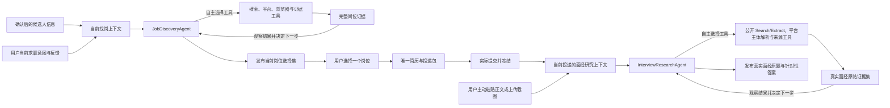

# OfferGuide 找岗位 Agent 与面经研究 Agent 重构 Spec

状态：实施中（找岗主链已切换；面经模块按收窄后的真实来源与原题回答边界重新实施）
版本：0.5
日期：2026-07-15

这是用户已经确认的找岗位与面经研究系统设计基线，也是本轮实施状态记录。它定义最终结果、两个领域 Agent 的所有权、信息流、事实边界和需要退出的旧系统。

新的生产实现必须包含两个由模型驱动工具调用的 Agent 任务：`JobDiscoveryAgent` 负责找岗位，`InterviewResearchAgent` 负责寻找类似岗位的真实面经、提取原文真实问题并结合实际提交的 JD 与简历写答案。它们可以共用同一个 Agent runtime，也可以由主 Agent 委托运行；物理类名可以调整，但不能用预先写死搜索顺序和判断分支的 Workflow、普通函数流水线或定时爬虫冒充 Agent。

本文出现的 Agent、上下文、证据集和当前结果都是逻辑契约。实现时应先读取真实调用关系，再选择最小、清楚的模块边界；不能为了匹配本文名词额外制造 Manager、Repository、数据表或仪式性中间状态。

旧字段、旧 Skill、旧测试、旧调研结论和重构前运行方式均不能反过来限制新系统。实现与本文冲突时，应修改或删除实现，而不是增加兼容层保留已经退出的概念。

## S-001 产品结果

简历系统解决的是用户选中岗位后的投递准备。找岗位与找面经系统分别补齐它的前后两端：

1. 投递前，系统根据用户当前目标主动找到仍可核验的真实岗位，取得完整 JD，形成一份有依据、有顺序、可直接选择的当前候选。
2. 用户选择岗位后，现有简历系统根据同一份 JD 生成唯一投递包。
3. 用户确认实际提交后，系统根据对方实际收到的 JD 和简历搜索类似岗位的真实面经，提取来源中实际出现的问题，并为这些原题写出针对当前投递的答案。

系统完成的标准是用户能够找到值得投的真实岗位，并能在投递后针对该岗位真正准备面试。两个任务必须由 Agent 根据现场证据自主选择行动，但“运行过 Agent”、工具调用数量、岗位数量、来源数量、调用成本、评分覆盖率和测试数量本身都不是产品结果。

## S-002 重构前调查基线

以下是 2026-07-14 开始实施前的调查快照，用于解释后文为什么必须退出旧链路，不代表当前生产架构：

- Web 启动的 ambient crawler、scheduler、DiscoverySubAgent、旧 autonomous jobs、主 Agent tools 和浏览器扩展分别拥有一部分找岗逻辑。它们只在部分入库位置汇合，搜索意图、完整 JD、评估、排序和反馈再次分叉。
- 当时数据库已有 234 个岗位和 184 条 scored events，但推荐页主要依赖没有真实校准依据的“HR 回复概率”；160 个 `score_match` run 全部缺少 job ID，只能再依赖另一张事件表拼回岗位。
- 当时岗位身份主要依赖 `(source, content_hash)`。同一岗位正文变化会形成新记录，重复抓取不会更新 `last_seen`，多个来源也无法可靠表示同一个岗位。
- 当时生产 scheduler 只注册 `wake_agent`。`interview_experiences`、`company_briefs` 和 `post_apply_materials` 均为 0，实际提交后的页面只读取已经存在的面经，不会为当前岗位主动搜索。
- 面经采集、质量分类、公司画像、题目预测、项目深挖、Mock 和复盘是多套互不知道完整上下文的代码。已写出的 corpus refresh/classify 任务没有进入当时的生产调度。

因此，本轮不是改几个阈值或补一个搜索按钮，而是重新确定信息所有权，并在新主链路接通后删除旧链路。

## S-003 唯一端到端信息流



Agent 在运行中读取当前上下文，选择搜索或读取工具，观察真实返回，再决定继续查找、换方向、比较现有证据或发布结果。代码不预先规定一套每次都执行的步骤。Agent 的临时搜索策略和中间推理不是要求用户维护的产品对象；数据库中只有被下游真实使用的信息才需要持久化。

## S-004 共同原则

1. 同一种结果只有一个 Agent 所有者。页面、后台刷新和主 Agent 委托都只能触发对应领域 Agent，不能各自产生不兼容的岗位选择集或面经问答。
2. Agent 先理解当前权威上下文，再决定需要查什么；任何外部事实只有在取得真实来源后才能被当作事实使用。搜索摘要、模型记忆和模型改写稿不能代替原始岗位页或面经页面。
3. Agent 中的模型负责理解当前情况和作出语义判断；确定性代码负责真实请求、原文保存、身份、时间、去重、冻结、引用关系和失败暴露。
4. 不把当前用户的专业、届别、方向、城市、日期、某家公司或某次搜索结论写成全局规则。
5. 不静默截断 JD、简历、项目事实、面经原文或用户反馈。真实超过模型容量时，应明确设计检索和遗漏记录，不能继续使用固定字符切片。
6. 一次没有找到结果不等于来源不存在。系统必须记录实际查过什么、哪些页面无法读取，以及哪些事实仍然未知。
7. 内部日志和测试用于排错与防回归，不能替代用户看到的真实岗位、真实来源和可用材料。
8. Agent run 可以因发布、确认无需更新、阻塞、上下文过期或失败而结束；只有发布了合格当前结果，或真实检查后确认现有结果无需更新，才算领域任务成功。一段自然语言总结、达到循环上限或调用过若干工具都不算完成。

# 第一部分：找岗位

## J-001 最终结果是一份当前岗位选择集

找岗的最终结果是一份随用户目标和真实市场更新的当前岗位选择集。它不预设固定岗位数量，也不按概率区间分桶。

其中每个岗位都必须让用户知道：

- 公司、岗位、地点、招聘类型及页面能够证明的时间信息；
- 完整 JD 和原始来源；
- 为什么它在当前目标下值得关注；
- 当前存在的具体顾虑和未知信息；
- 页面最近何时被成功读取，以及是否仍能确认开放；
- 查看原岗位、暂不考虑和准备投递等直接动作。

数据库中发现过多少岗位、爬虫跑了多少来源、模型处理了多少条，不作为推荐页主要内容。

Agent 完成了一次有实际覆盖的搜索、但没有找到满足当前意图且拥有完整证据的岗位时，可以发布一份带检索范围和真实缺口说明的空选择集。这比为了填满页面推荐薄 JD 或失效岗位更正确。

## J-002 当前找岗上下文

系统只保留一份用户能够直接理解和修改的当前找岗语义文档。它表达：

- 用户现在想寻找的工作和所处阶段；
- 用户明确说出的地点、时间、招聘类型等硬约束；
- 用户明确表达的偏好、可接受范围和方向调整；
- 对具体岗位的保留、忽略和选择反馈中，确实会影响后续搜索的部分。

确认后的 master 简历和 Project Vault 是能力与经历证据，通过引用进入找岗上下文，不复制成另一套职业画像。它们帮助模型判断岗位，却不能把用户限制在简历已经写过的岗位名称和技术词中。

模型可以从自然语言中提出对当前意图的理解，但不能静默把推测升级为硬约束。用户对单个岗位说“不考虑”只影响该岗位；只有用户表达普遍偏好时，才更新后续搜索方向。

`user_keywords`、keyword chips、固定技术词表和硬编码当前届别都不属于新的用户输入。

## J-003 JobDiscoveryAgent 的目标与自主循环

`JobDiscoveryAgent` 是当前岗位选择集的唯一生产者。每次运行时，它直接读取完整找岗上下文、候选人证据、已有岗位证据和上一份当前选择集，然后围绕“找到当前真正值得用户选择的真实岗位”自主行动。

它可以根据刚取得的结果反复选择下一步，包括：

- 应搜索的岗位方向、同义名称和必要的相邻方向；
- 适合使用的官方招聘页、招聘平台、普通网页搜索或登录态页面；
- 本轮具体查询、继续读取哪些线索以及哪些待核验岗位需要补全；
- 是否检查已有岗位的更新或开放状态；
- 何时比较当前证据，何时需要换查询、扩大范围或继续追踪原页面；
- 何时证据已经足以发布新的当前岗位选择集。

上述行动顺序由 Agent 查看每次工具返回后现场决定。代码不能预先编排成“固定来源抓取 → 固定关键词过滤 → 逐岗打分 → 阈值排序”，也不能先跑完一套 crawler 再只让模型为结果写说明。

这些决定属于本轮 Agent 任务，不作为长期关键词字段，也不升级为固定公司列表、域名顺序、年份、岗位黑白名单、查询数量或固定停止阈值。

搜索策略必须转化成代码能够执行的来源请求。工具说明与实际能力必须一致，不能再次出现工具声称可以 Web 搜索和抓正文、实际只有固定 fetcher 的情况。

## J-004 来源获取与证据门槛

平台列表页、搜索结果页、聚合仓库和转载可以提供岗位线索，但线索只有在继续取得可核验的岗位详情后才能进入当前岗位选择集。

可以作为推荐依据的岗位页面至少需要：

- 能定位该岗位的真实 URL 或来源岗位 ID；
- 足以让用户理解职责和要求的 JD 正文；
- 明确的公司和岗位身份；
- 本次实际读取的时间；
- 来源页面对开放、关闭或未知状态提供的证据。

官方招聘页和真实招聘平台的完整岗位页都可以成为证据。来源类别本身不取代页面内容判断。只拿到标题、卡片摘要或搜索 snippet 的记录可以保留为待核验线索，但不能伪装成完整岗位参加推荐。

页面无法读取、登录失效或反爬阻止时必须保留真实失败状态。系统可以稍后重试、切换登录态浏览器或请用户补充，但不能由模型补写 JD。

## J-005 岗位身份、更新与下架

同一来源中的岗位优先使用稳定的来源岗位 ID；没有可靠 ID 时使用规范化后的详情 URL。正文 hash 只能辅助判断内容变化，不能继续充当岗位身份。

同一岗位重新抓取时应更新当前正文、来源状态、最近检查时间和最近成功看到的时间。JD 内容变化应记录为同一岗位的更新；用户开始准备投递或实际提交时，由简历系统冻结当时使用的岗位快照。

多个来源可能指向同一岗位。能够确定相同时建立来源关联并选择最可靠的当前正文；无法确定时保持独立，不能为了减少数量误合并。

“已关闭”只能来自页面明确状态、可靠的来源响应或持续无法定位后的明确判定。无法确认时显示未知，不将抓取失败直接等同于岗位下架。

每个来源必须拥有真实增量位置或更新时间。`last fetch` 必须表示实际检查时间，不能继续用最后一次成功插入新岗位的时间代替。

## J-006 岗位比较与排序

`JobDiscoveryAgent` 在共享的当前上下文中比较真实岗位，最终发布一个有顺序的选择集。底层可以为容量和并发分批读取，但 Agent 必须回看候选并形成同一轮、同一标准下的整体判断，不能把互不关联的逐岗标量直接排序。

每个入选岗位的最小语义结果只有：

- 对应岗位证据；
- 为什么当前值得关注；
- 需要用户留意的顾虑；
- 尚未从来源确认的关键信息。

不再输出或保存“HR 回复概率”，不使用 30%/15% 阈值，也不要求 Agent 填满技术、经验、公司层级、竞争度等固定评分维度。Agent 可以认为一个岗位是合理的延伸方向，但必须解释为什么，而不是用关键词重合包装成精确分数。

用户明确确认的硬约束可以确定性执行。岗位价值、能力迁移、发展方向和是否值得尝试由 Agent 结合完整 JD、找岗意图和候选人证据判断。

## J-007 用户反馈继续进入下一轮

用户可以直接修改当前找岗语义文档，也可以对岗位执行准备投递、暂不考虑或自然语言反馈。

- 准备投递将当前岗位证据原样交给唯一简历工作区，不能重新搜索并换成另一份 JD。
- 暂不考虑的岗位在内容没有实质变化、用户目标没有变化时不应立即重新出现。
- 用户说“这个方向少一点”“地点不合适”“多找类似岗位”时，Agent 把反馈解释成对当前找岗上下文的候选修改，并让用户看见新的理解。
- 系统不能从一次局部反馈自动创造永久职业规则。

用户直接编辑语义文档时，确定性接口创建新的上下文 revision。用户提供自然语言反馈时，原话先被保存，`JobDiscoveryAgent` 再通过专属上下文更新工具处理：用户已经明确表达的普遍偏好可以直接进入一份用户可见的新 revision；需要额外推断的方向变化只能形成待用户确认的提议；硬约束只能来自用户直接编辑或明确确认。该工具以 Agent 读取的旧 revision 做 compare-and-swap，成功后当前运行转而绑定新 revision，发生并发修改时则要求 Agent 重新读取。主对话 Agent 不能把自己的私有理解留在聊天记录里代替这次更新。

用户反馈的价值是改变下一次真实搜索和排序，而不是进入一个没有消费者的 reflection、fitness 或 worldview 字段。

## J-008 自动刷新与手动刷新触发同一个 Agent

系统需要主动找岗位，因此既支持用户立即刷新，也支持后台定期检查新岗位和旧岗位状态。两种方式都只负责构造触发原因并启动同一个 `JobDiscoveryAgent`；主 Agent 的找岗请求也只能委托它，不能自行生产另一份结果。

Agent 可以因不同触发原因选择不同的行动，例如后台运行时优先检查新增和变化，用户修改方向后重新探索；这些选择由 Agent 根据完整上下文作出，不由触发入口复制一套业务分支。

后台刷新不能擅自修改用户找岗意图。多进程和重复触发必须具备互斥或幂等保护；不能让 Web lifespan、独立 daemon 和 scheduler 同时运行三套逻辑。

来源错误和本轮实际检查情况应进入可诊断状态。只有会影响用户判断的失败才需要在主界面说明，不能再用来源数量和抓取成本占据推荐页面。

## J-009 推荐界面

推荐页围绕“理解当前目标、比较真实岗位、选择下一步”组织：

1. 页面顶部展示当前找岗意图，可直接修改，并显示本轮搜索或刷新状态。
2. 当前岗位按行动顺序展示公司、岗位、地点、真实时间信息、推荐原因、顾虑和未知项。
3. 用户可以展开完整 JD、打开原始岗位页、暂不考虑或进入准备投递。
4. 页面明确区分仍在获取详情的线索、已核验岗位和无法确认开放状态的岗位。
5. 刷新失败时保留上一份完整结果，不用空页面覆盖，也不把失败伪装成“没有岗位”；找岗意图已经变化时，旧结果明确标记为基于上一版意图。

页面删除概率分组、预算提示、来源数量、公司层级、下轮关键词、评分覆盖率和内部 skill run 信息。

## J-010 找岗位逻辑数据契约

新系统至少需要表达以下四类逻辑信息，但不要求对应四张表或四个类：

```text
当前找岗上下文
  用户可读的当前意图
  仅由用户确认的硬约束
  会影响后续搜索的反馈
  确认后的候选人信息引用

岗位证据
  稳定岗位身份与来源身份
  原始 URL、完整正文和来源状态
  本次检查、最近看到和页面时间信息
  必要的内容更新记录与跨来源关系

当前岗位选择集
  使用的是哪一版找岗上下文
  有顺序的岗位证据引用
  每个岗位的推荐原因、顾虑和未知项
  本次结果生成时间

来源检查记录
  实际执行的查询或平台动作、来源和时间
  返回的 URL 或来源身份
  正文读取成功、受限或失败状态
```

模型没有执行的查询草稿、临时候选、中间推理和调试统计默认不成为长期产品状态。已经真实执行的查询、来源返回和读取失败最小化保存，因为它们是证明本轮实际查过什么以及为何得到空结果的执行证据。

# 第二部分：找面经与原题回答

## I-001 触发条件与最终结果

用户确认“已经实际提交”后，系统冻结投递版本，并立即为这次真实投递寻找类似岗位的真实面经。搜索可以异步进行，但投后页面必须显示真实进度，不能在没有来源时先生成题目。

每次投递只有一份当前面经问答。它只包含三件事：取得可追溯的真实面经原文、提取原文中实际出现的问题、结合对方实际收到的 JD 和简历为这些问题写答案。

本模块不是完整面试准备套件，也不以内容丰富为由扩展产物。公司背景、流程预测、预测题、项目追问树、通用技术题、学习计划、Mock 和复盘都不由 `InterviewResearchAgent` 生成。

## I-002 唯一研究主语是冻结的投递版本

面经研究从 submitted workspace 取得完整且不变的输入：

- 当前 `application_id` 与 `submitted_workspace_id`；
- 投递时冻结的公司、岗位、完整 JD 和岗位来源；
- 对方实际收到的 ResumeDocument 与 PDF。

Agent 不能只用公司名查询，也不能改读后来变化的 live JD、master 简历或任意历史 Skill run。JD 与简历不做固定字符截断。

回答可以使用解释问题所需的通用专业知识；凡是关于候选人自身经历、职责、成果和能力的陈述，只能来自实际提交简历中的事实。简历没有提供、但回答必须依赖的个人事实应明确留空或请用户补充，不能由模型补写经历。

## I-003 InterviewResearchAgent 的目标与自主循环

`InterviewResearchAgent` 是每个 submitted workspace 当前面经问答的唯一生产者。每次运行读取冻结 JD、实际提交简历、已有面经来源和上一份当前结果，围绕“找到真实相似岗位面经，并回答其中真正问过的问题”自主行动。

它根据每次真实工具返回决定下一步，包括：

- 如何从岗位职责、工作内容和常见岗位别名形成当前查询；
- 哪些候选页面可能是实际发生过的面试记录，哪些只是招聘帖、题库、建议文章或聚合摘要；
- 哪些公开页面需要继续提取正文、使用哪个平台主体解析器，以及何时更换查询或来源；
- 已取得面经与当前岗位是否足够相似，原文中哪些句子确实是面试问题；
- 当前真实面经是否足以发布，还是应继续寻找更相似的材料。

代码不写死查询年份、毕业届别、固定域名、平台顺序、查询数量或“公司名搜索后取前 N 篇”的流程。搜索计划是本次 Agent 的临时行动，不成为用户需要维护的状态。

## I-004 来源获取与账号安全

面经发现使用经过正式接入和评估的公开 Search 服务；候选 URL 的正文使用正式 Extract 服务或无需登录的平台公开页面接口取得。已知平台的主体解析器优先用于提纯发帖正文，但解析器不认识某条 URL 路径、SSR 数据形状或 DOM 结构时，不能据此拒绝来源；系统继续使用搜索服务已经取得的完整正文、正式 Extract，或保存完整可读公开页面，并如实标记内容范围。Agent 完整阅读保存正文后判断其中是否真实记录了面试及哪些原句确为实际问题，不能把推荐内容、评论区、广告、站内导航或页面附带的 AI 答案选入问题集合。

搜索标题、snippet 和模型对搜索摘要的改写只能作为待读取线索。没有取得可验证的原帖正文，就不能从该线索提取问题或生成答案。

面经模块禁止读取、保存或自动使用用户账号、Cookie 和登录态，不使用 authenticated browser、二维码登录、CDP、浏览器 profile、指纹伪装、代理轮换、多账号或所谓 stealth 方案。不能为了多取一个平台的内容，把封号风险转移给用户。

遇到登录墙、验证码或只能在用户账号中查看的页面时，系统停止自动获取。只允许用户主动粘贴正文或上传自己选择的截图；系统处理这份明确提交的内容，但不代替用户搜索、点击、滚动或后台读取当前登录页面。用户提供的正文或截图进入同一来源保存、原题提取和问答路径，并明确标记为用户提供。

声称提供平台数据的第三方 API 只有在单独确认许可范围、数据来源、内容完整性、可追溯性和生产使用条件后才能接入。完成评估前，它既不是默认来源，也不能被包装成“账号安全”的既定方案。

## I-005 原帖证据与真实问题

每个被实际使用的面经来源至少保留：

- 原始 URL、页面标题、完整可读取正文及其范围标记；平台主体解析成功时保留提纯后的原帖主体，否则保留供 Agent 判断的完整公开正文；
- 本次获取时间，以及页面能够证明的发布时间或面试时间；
- 获取方式：公开 Search/Extract、公开平台接口，或用户主动提供；
- 原始内容 hash、重复或转载关系和读取不完整状态；
- 从原文提取的问题原句及其紧邻上下文。

用户上传截图时保留原图和 OCR 文本；无法可靠识别的字句必须标为不确定，不能悄悄改成完整问题。

Agent 可以根据上下文还原省略的主语或把一段连续追问拆开显示，但必须同时保留原句，且不能添加来源没有问过的替代题、扩展题或“可能还会问”。同一问题出现在多篇来源时可以关联来源，不能在没有证据时写成“高频”。

## I-006 岗位相似度与来源选用

来源选用首先看岗位和工作内容是否与当前 JD 相似，同公司是重要加分项，但不是凌驾于岗位相似度之上的硬层级。同公司但职责无关的面经，不能排在其他公司高度相似岗位的真实面经之前。

Agent 结合职责、业务对象、能力要求、岗位层级和招聘类型判断相似性，不使用预设关键词重合率或固定数值公式。最终页面应简短说明每篇来源为何与当前岗位相关，并展示来源公司与岗位，让用户能够自行判断。

只有明确记载一次真实面试、并包含实际提问内容的来源才能进入问题集合。商业题库、求职建议、岗位 JD、公司宣传、新闻、泛化技术文章和模型生成题单即使标题含“面经”，也不能作为真实面经使用。

完成有实际覆盖的搜索后仍没有取得真实相似岗位面经时，Agent 发布明确的空结果：“未找到可读取的真实相似岗位面经”。结果同时列出实际搜索范围与主要访问缺口，但不生成替代问题、预测问题或泛化准备内容。

## I-007 一份当前面经问答

非空结果按真实来源和问题组织，至少让用户看到：

- 本次实际使用了哪些面经，以及它们与当前岗位的关系；
- 每个问题的原文、必要上下文和可打开的来源；
- 针对该问题的答案；
- 答案使用了实际提交简历中的哪些事实，以及哪些表述需要用户补充后才能成立。

答案必须真正回应原题，并结合当前 JD 的岗位语境选择重点；不能只复述问题、堆砌简历关键词，也不能把通用知识包装成候选人已经完成的项目或业绩。Agent 根据问题本身决定答案结构与展开深度，不使用固定题数、固定字数、固定类别或被问概率。

当前结果的最小逻辑契约是：

```text
当前面经问答
  application_id 与 submitted_workspace_id
  状态：found | not_found
  实际搜索范围与访问缺口
  使用的面经来源[]
    原帖证据引用
    来源岗位与当前岗位的相关性说明
  问答[]
    来源引用
    原文问题与紧邻上下文
    针对当前 JD / submitted resume 的答案
    使用的简历事实或待用户补充项
  生成和最近更新时间
```

这是逻辑契约，不要求按字段名新建一组表或类。原帖证据可以跨投递复用，但岗位相似度、问题选用和答案必须针对当前 submitted workspace 重新判断。

## I-008 更新与投后界面

首次实际提交、用户要求刷新、发现新的公开原帖，以及用户主动粘贴正文或上传截图，都可以触发同一个 `InterviewResearchAgent` 更新当前面经问答。更新不能修改已经冻结的 JD 和简历；上一份完整结果保留到新结果原子发布，不能用运行中的半成品覆盖。

投后页面围绕当前投递展示：

1. 公司、岗位、提交时间，以及冻结 JD 和实际提交简历的查看入口；
2. 面经搜索状态、本轮实际查找范围和受限来源；
3. 每篇真实面经的来源、相关性说明和原帖入口；
4. 从原文提取的问题与对应答案；
5. 用户主动粘贴正文或上传截图的入口；
6. 没有真实相似岗位面经时清楚、完整的 `not_found` 状态。

页面不展示公司背景、预测题、项目追问树、学习计划、Mock 或复盘入口来填补空白。独立 `/interviews` 页面如果保留，只作为本模块已保存原帖证据的查看器，不要求用户维护全局面经库。

## I-009 面经研究逻辑数据契约

新系统只需表达以下三类逻辑信息：

```text
当前面经研究上下文
  application_id 与 submitted_workspace_id
  冻结 JD 与 submitted resume 引用

面经原帖证据
  URL、标题、原帖主体、时间与获取方式
  读取成功、受限、不完整或用户提供状态
  重复、转载关系
  原文问题与上下文

当前面经问答
  found 或 not_found
  使用的来源及岗位相关性
  原文问题、来源引用与针对性答案
  搜索范围、访问缺口和更新时间
```

旧 `company_briefs`、泛化 `post_apply_materials`、预测题和准备计划结构不能继续限制这个契约。物理 schema 在实施时按 submitted workspace、原帖证据和当前结果的真实调用关系决定，不为空表或旧消费者增加兼容层。

# 第三部分：实现边界

## B-001 两个领域 Agent，共用确定性来源能力

产品中存在两个业务所有者：

- `JobDiscoveryAgent` 围绕当前求职意图工作，拥有当前岗位选择集的唯一发布权。
- `InterviewResearchAgent` 围绕某次 frozen submission 工作，拥有该投递当前面经问答的唯一发布权。

两者可以共用同一个 Agent runtime，以及搜索接口、URL 规范化、原文保存和来源读取状态等确定性底座，但权限不同：找岗来源能力按第一部分执行；面经来源能力只能使用公开 Search/Extract、无需登录的平台主体解析和用户主动提供的正文或截图，不能继承找岗可能使用的登录态浏览能力。两者不共享业务上下文，也不能为了代码复用被合并成一个输入和结果所有权都不清楚的万能 Agent。

推荐页、投后页、后台触发器和主对话 Agent 都只是触发者或委托者。它们不拥有搜索步骤、语义判断和当前结果写入权。

## B-002 Agent 不是改名后的固定流水线

每次 Agent 运行都必须具备以下行为：

1. 读取本任务的权威完整上下文、已有证据和上一份当前结果。
2. 由模型查看当前可用工具并决定下一项行动，而不是接收代码预先生成的步骤表。
3. 调用真实工具，取得带稳定证据身份的结果，再把结果交还同一个 Agent 观察。
4. 根据新证据继续追踪、改变查询、回看已有材料、比较候选或准备发布。
5. 证据足够时通过领域发布工具原子更新唯一当前结果；证据不足或来源受阻时明确报告缺口。

代码可以固定工具能力、权限、事实校验、并发、持久化和运行保护，但不能固定查询顺序、来源优先级、关键词展开、岗位比较维度、面经相关性、内容章节或“跑到第几步就完成”。

当前 `DiscoverySubAgent` 的通用短提示词、固定工具组、固定少量迭代、截断后的 tool result 和只返回文本 summary 的契约不能原样充当新的 `JobDiscoveryAgent`。可以复用经过清理的循环基础设施，但必须替换它的上下文、工具、完成语义和结果写入方式。

## B-003 Agent 上下文与持久状态

Agent 的上下文来自领域事实，不来自要求模型自行维护的全局 worldview、work item、fitness、reflection 或任意历史 Skill run。

`JobDiscoveryAgent` 每次读取当前找岗语义文档、用户确认的约束与反馈、候选人信息引用、已有岗位证据和当前选择集。`InterviewResearchAgent` 每次读取 submitted workspace 中冻结的 JD 与实际提交简历、已有面经原帖证据和当前面经问答。

Agent 的查询草稿、中间比较和临时行动计划只存在于本次运行。已经执行的查询、使用的来源后端、返回 URL、读取状态和失败原因作为最小执行证据保存，但不保存 chain-of-thought。岗位原文、面经原文、来源状态、用户输入、冻结投递和已发布当前结果也是跨运行持久状态。下一次触发通过这些真实状态继续工作，不靠模型回忆上一次私有推理。

## B-004 Agent 工具与唯一发布入口

两个 Agent 的来源工具都必须能够真实搜索、保存完整正文、重新读取已保存来源并返回明确失败。搜索工具返回的是待追踪线索；只有正文获取工具成功保存的页面才成为可引用证据。共用接口不能抹掉权限差异：面经工具集不注册 authenticated browser、Cookie 或任何登录态读取工具。

找岗位 Agent 还需要能够读取已有岗位、通过平台适配器搜索、补全或更新岗位证据、检查来源状态，并发布当前岗位选择集。面经 Agent 还需要能够读取冻结 JD 与 submitted resume，通过公开 Search/Extract 发现和取得原帖、调用平台主体解析器、接收用户主动提供的正文或截图、提取原文真实问题，并发布当前面经问答。

以上是工具能力契约，不要求机械照搬工具名。所有工具说明必须与真实实现一致。来源工具先保存完整证据，再向 Agent 返回证据 ID 和可阅读内容；不能只返回数量，也不能只返回被截断且无法继续读取的摘要。

外部岗位页、面经页和用户粘贴网页始终作为标记清楚的 untrusted evidence 进入模型，不能改变 Agent instructions、工具权限、事实边界或完成条件。来源工具确定性限制 URL scheme、重定向目标和内容类型；遇到超大内容时保存或明确拒绝并提供可继续读取的方式，不能静默截断成看似完整的正文。

只有领域发布工具可以改写当前岗位选择集或当前面经问答。发布时确定性校验所有岗位和引用确实存在、属于当前上下文且没有用 snippet 冒充正文；面经问题还必须引用原帖主体中的真实文本。校验后在一次原子写入中替换当前结果。普通搜索、抓取、页面 GET 和定时触发不能隐式发布或另建结果。

找岗 Agent 还拥有写入可见找岗上下文 revision 的专属能力；用户主动提供的面经正文或截图只能由绑定 application 的确定性入口写入研究上下文。两者都不能通过全局 memory 或运行总结暗中改变领域上下文。

## B-005 Agent 判断与确定性代码的边界

| 确定性代码负责 | Agent 中的模型判断负责 |
| --- | --- |
| 按领域权限执行真实请求 | 理解当前找岗或面经目标 |
| 保存 URL、原文、时间和来源状态 | 决定下一次查询、工具和展开方向 |
| 稳定岗位身份、更新、去重和冻结 | 判断岗位价值、能力迁移和顾虑 |
| 解析并保存面经原帖主体、重复关系和引用 | 判断面经是否真实以及岗位相似度 |
| 校验问题原文确实存在于来源 | 提取真实问题并结合 JD / submitted resume 写答案 |
| 校验并原子替换一个当前结果 | 判断何时继续研究以及何时发布 |
| 暴露读取失败和未知状态 | 在没有真实相似面经时发布明确空结果 |

Agent 不能发明岗位、JD、发布日期、开放状态、面经原文、真实面试轮次或候选人已经发生的经历。确定性代码不能用固定词表、概率公式、页面阈值或固定流程替代 Agent 的当前语义判断。

## B-006 完成、失败与恢复

每次 Agent run 只有以下领域结果：

- `published`：原子发布了新的当前结果，可以是正常非空结果，也可以是有充分执行证据和缺口说明的空结果。
- `unchanged`：Agent 完成了真实检查，确认当前上下文和现有结果仍匹配，且没有值得重写结果的变化。这是成功运行，但不为了制造更新而重新生成内容。
- `blocked`：缺少必要输入，或配置的公开来源服务不可用，Agent 已说明阻塞和已完成的检查，但没有足够依据发布结果。
- `stale`：运行期间 subject context 或 current result revision 已变化，本次取得的证据可以保留，但本次运行失去发布资格。
- `failed`：模型、工具或持久化出现非预期错误，没有发布结果。

找岗 Agent 发布的结果必须包含完整 JD、来源、推荐原因、顾虑和未知项；完成有效搜索却没有合格岗位时可以发布空选择集。面经 Agent 的非空结果必须包含真实面经原帖、原文问题和针对 submitted JD/resume 的答案；完成有实际覆盖的搜索却没有取得真实相似岗位面经时，发布明确的 `not_found` 空结果，不能根据 JD 或简历自行生成替代题目。

Agent 输出一段总结、调用 `done`、达到迭代或时间等运行保护上限，或者只保存了部分来源，都不能被记录成 `published` 或 `unchanged`。部分来源失败但其余证据足以支持完整结果时可以 `published`，并在结果中暴露缺口；证据不足时是 `blocked`，不发布半成品。

搜索或模型调用失败时保留上一份完整结果，已经取得的原始证据单独保存，不因后续生成失败而丢失。如果当前上下文 revision 已经变化，上一份结果仍可供用户查看，但必须标记为“基于上一版找岗意图或 submitted workspace”，并同时显示正在刷新、阻塞或失败，不能无标记地冒充新上下文的当前判断。

迭代数、耗时、调用成本和工具轨迹可以留作诊断，但不能决定领域结果，也不进入用户的主要内容。

找岗运行绑定它读取的找岗上下文版本；面经研究运行必须绑定具体 `application_id` 和 `submitted_workspace_id`，不能只用 `job_id`，因为同一岗位的不同实际投递可能拥有不同简历和材料。

每次运行启动时固定 subject context revision 和当时的 current-result revision。发布工具执行 compare-and-swap：只在两者仍然匹配时替换当前结果。用户修改找岗上下文，或为当前投递新增正文、截图等来源而产生新 revision 时，较早运行可以保留它取得的证据，但必须被标记为 stale 并拒绝覆盖新上下文下的结果。

同一触发任务需要幂等；重复触发不能重复创建岗位、来源或第二份当前材料。用户请求、提交事件和后台触发只创建或复用一次绑定 subject revision 的 Agent invocation。运行不能依赖浏览器连接持续存在；同一 subject 默认只有一个有效运行，新的上下文 revision 可以让旧运行失去发布资格。页面只需如实显示等待、运行以及最终的 `published`、`unchanged`、`blocked`、`stale` 或 `failed`，不要求用户维护 invocation。

运行保护只负责阻止失控调用。触发保护后属于 `blocked` 或 `failed`，不能升级成岗位价值、材料质量或产品完成规则。

## B-007 不静默丢失信息

当前 Agent tool 对 JD 和简历的 4000 字截断、面经 collector 的 1500 字模型改写入库、SubAgent 的固定 tool result 截断，以及任何固定前 N 条导致后续查询永远无法读取的逻辑都退出设计。

实现确实需要分批时，必须保留完整原文和最终覆盖记录。Agent 可以先检索相关片段，但它和用户都必须能够通过证据 ID 继续读取完整来源；分批不能造成永久不可见的信息。

当前选择集或面经问答过大、不适合通过一次 tool argument 完整提交时，Agent 可以分块写入绑定 subject revision 的内部 draft artifact，再调用领域发布工具原子切换 current pointer。draft artifact 不算完成，也不成为用户需要选择的第二个版本；发布失败时仍保留上一份完整当前结果。

# 第四部分：旧系统退出范围

## R-001 找岗位旧链路

新找岗主链切换后，以下概念和入口退出生产：

- `score_match` 的 HR 回复概率、calibration、固定评分维度及对应 scored event 拼接；
- `match_keywords.py`、`job_quality.py` 中针对当前用户手写的技术与岗位词表；
- 推荐页的 30%/15% 分桶、预算、来源数量、公司层级、自动关键词和评分覆盖率；
- Web lifespan ambient、scheduler wake、旧 `DiscoverySubAgent` 实现和 autonomous jobs 各自拥有的一套抓取或评分主循环；
- `discover_jobs` 宣称与实际 tool 能力不一致的接口；
- `auto_pipeline`、`auto_score_jobs`、断开的 `jd_enrich` 和多套不一致评分写入契约；
- 旧浏览器扩展的 inline score 和独立岗位写入路径。

现有平台 parser、官方招聘 API、普通搜索、登录态浏览和其他能够取得真实岗位正文的代码可以迁移为共用来源能力。迁移完成前先确认调用者；迁移完成后删除旧所有者，不长期保留双轨兼容。

现有岗位历史不整库删除。只有能回到真实来源的内容才迁移为岗位证据；只有标题、错误身份或无法确认来源的记录保留为待核验历史，不能直接进入新推荐。

## R-002 面经旧链路

新面经研究主链切换后，以下概念和入口退出生产：

- 固定 2026/2027、暑期实习、固定域名与固定查询的 `CorpusCollector`；
- 未进入当前生产调度的 `corpus_refresh`、`corpus_classify` 和孤立的 company sweep；
- 只按公司名 `LIKE` 取最新若干篇的 `fetch_for_company`；
- 没有生产消费者的全局 corpus quality 信号矩阵；
- 最多 8 题、至少 3 类和 likelihood 百分比驱动的旧 `prepare_interview` schema；
- 公司背景、流程预测、预测题、通用技术题、项目追问树、学习计划和 `deep_project_prep`；
- 作为本模块产物或入口存在的 Mock、面试复盘及其输入拼装路径；
- authenticated browser、Cookie、登录态会话、二维码登录、CDP、stealth、代理池和多账号等面经抓取能力；
- 把推荐内容、评论、广告、导航或页面附带 AI 答案与原帖混合保存的整页抓取路径；
- 不能立即进入当前原帖保存、问题提取和问答更新路径的孤立手动面经入库接口。

用户主动粘贴的正文和上传的截图应迁移到新的统一来源入口。旧 Skill run 可以在确有用户历史价值时归档，但不能参与新的当前结果；没有可追溯原帖的旧生成内容不能迁移为面经证据。

## R-003 文档、测试与运行记忆

实施完成后删除或重写所有要求恢复旧概率、固定关键词、固定年份、固定题数、全局质量分数、双 scheduler 或空 corpus 仪式的测试和说明。

`AGENTS.md`、`resume_system_redesign.md` 和用户确认后的本文是当前产品基线。旧调研可以作为历史证据存在于 Git 历史中，但不继续留在当前工作树污染实现判断。

生产数据库中的旧 score runs、无来源推荐事件和空面经结构只在确认没有当前消费者后清理。清理不改动已冻结的投递 workspace、实际 PDF 和用户真实输入。

# 第五部分：实施顺序

## P-001 先确认 Spec

状态：已完成。

用户已确认本文。后续如果对结果、信息流或边界有新异议，先修改本文，不通过写代码制造既成事实。

## P-002 建立 Agent runner 与共用真实来源底座

状态：实施中（Agent runner 已落地；面经来源权限与主体解析按 0.5 版边界重建）。

从当前 ReAct loop、ToolRegistry、调度运输和页面运行事件中只复用真实通用能力，建立一个能够显式接收 Agent instructions、完整 context loader、专属工具集合、领域发布工具和运行事件出口的小型 runner。它不拼装 worldview、通用 work item 或全部全局工具，也不把 `done(summary)` 当成领域完成。

统一普通搜索、完整正文获取、URL 与来源身份、原文保存和读取失败表达，但保留领域权限差异：找岗可以使用第一部分允许的平台能力；面经只注册公开 Search/Extract、无需登录的平台主体解析和用户主动提交来源。这里不创建万能业务 Agent。

同时确定真实 schema 迁移方式，特别是岗位稳定身份、来源快照、submitted workspace 与面经来源引用。

当前已经落地专用 Agent runner、来源原文存储与分页读取、revision/CAS 发布、幂等 invocation 和后台协调器。Web、后台触发与主 Agent 委托通过同一个 `ResearchAgentService` 装配两个领域 Agent；现有面经工具集仍需按 I-004 删除登录态能力并补齐平台原帖主体解析，不能因 runner 已存在而把本阶段标为完成。

## P-003 完成 JobDiscoveryAgent 并切换

状态：已完成。

接通当前找岗上下文、`JobDiscoveryAgent`、真实来源工具、岗位更新、领域发布工具、当前岗位选择集和推荐页面。用真实来源验收后，将 Web、后台和主 Agent 委托全部切换为触发这个 Agent，并在本阶段删除旧概率评分和双轨找岗链路。

不能先长期保留“新推荐页 + 旧 ambient + 旧 score_match”并存，再把清理推到未来。

当前找岗上下文、`JobDiscoveryAgent`、真实来源工具、岗位证据、唯一当前选择集和 `/recommended` 已接通；Web 后台刷新与主 Agent 的 `research_jobs` 只触发同一个 `ResearchAgentService`，不再自行生产另一份推荐。代表性真实找岗运行、来源证据审查、桌面与手机推荐页面以及“准备投递”入口已经验收；apply-pack 读取用户所选当前结果中的完整岗位证据，并在工作区冻结同一份岗位快照。旧概率评分、crawler、worker 与 autonomous 所有者已经退出生产找岗所有权。仓内仍存在的 worldview、work item、evolution 等外围遗留不属于第二条找岗链路，其清理继续记在 P-005，不能反过来把 P-003 写成仍在双轨运行。

当前用户可以直接编辑意图、硬约束和每一条持续反馈，所有写入都绑定页面读取的 context revision；具体岗位的“暂不考虑”也会成为同页可见、可修改、可删除的反馈。当前没有接收“请模型理解这段自然语言并改写长期找岗方向”的独立产品入口，因此不暴露一个没有真实消费者的 JobDiscoveryAgent 上下文改写工具。主 Agent 的 `research_jobs(intent=...)` 只接受用户已经明确表达的当前意图，并以刚读取的 revision 做确定性 CAS；未来增加自然语言方向反馈入口时，再按 J-007 接入领域 Agent 的候选修改与确认语义，不能复用当前直接编辑接口冒充模型理解。

## P-004 完成 InterviewResearchAgent 并切换

状态：按 0.5 版重新实施中（旧实现范围过宽，不能作为当前设计的完成依据）。

接通 submitted workspace、`InterviewResearchAgent`、公开 Search/Extract、平台原帖主体解析、用户主动提供来源、原文真实问题、针对性答案、`found/not_found` 发布工具和投后页面。提交事件、刷新和主 Agent 委托只能触发这个所有者，不能自行生成另一份题单。

旧实现已经具备 submitted workspace、来源保存、分块暂存、原子发布和投后展示等可复用底座，但其来源工具允许登录态浏览，材料契约也混入公司资料、推断和其他准备内容，因此不能表面改提示词后继续使用。实施必须先删除这些权限与产物，再把原帖主体、原文问题和答案建立为唯一信息流。

完成条件是用真实 submitted workspace 运行新主链，逐篇确认保存内容确为原帖主体、逐题确认原文中确实出现、逐答确认只使用 submitted JD/resume 中的候选人事实，并在找不到真实相似岗位面经时发布清楚的 `not_found`，不出现替代题目。

## P-005 清理数据库、说明和旧测试

状态：实施中。

确认生产调用关系和真实用户数据后，删除退出概念对应的字段、表、文件、路由、模板、测试和运行记忆。旧系统不能继续通过兼容层影响新实现。

空的退休表已经采用“非空即拒绝迁移”的保护方式清理，旧找岗评分、autonomous/worker 所有者、旧面经 corpus/brief、固定题单和旧 Skills 已从新的领域主链退出；当前入口说明也已切换到新系统。但全仓清理尚未完成：`agent_runtime` 仍保留 worldview/MemoryStore 与 work-item 机制，evolution 模块、相关 schema 和旧测试仍在当前工作树。必须先审计剩余消费者，再删除或迁移这些外围实现和说明，并完成全仓引用审计与最终回归；在此之前不能把 P-005 写为完成。

## P-006 完整链路验收

状态：实施中（分段真实验收已完成，连续全链路尚未签收）。

最后从当前找岗意图开始，走通真实搜索、选择岗位、唯一简历、实际提交、真实相似岗位面经搜索、原文问题提取和针对性答案。验收使用最终页面、原始来源和实际 PDF，不以单元测试或数据库行数代替真实效果。

推荐页、apply-pack、真实 PDF 和旧投后页已经做过分段检查，但旧面经材料与当前 0.5 版产物不同，不能继承旧验收结论。真实库未把 job#233 伪造为已提交。P-006 只有在同一上下文连续走完整条链，并逐页核对原始来源、实际 PDF、原文问题与最终答案后才能完成。

# 第六部分：验收标准

## A-001 找岗位真实验收

一次真实找岗任务必须证明：

1. 用户只需表达自然语言求职意图，不维护关键词矩阵。
2. 系统本轮实际请求真实来源，并取得新的可打开岗位页和完整 JD。
3. Agent 能根据首轮工具结果继续读取线索、改变查询或检查其他来源；执行记录证明行动来自本轮返回，而不是固定抓取清单跑完后再写说明。
4. 同一岗位再次出现时更新原记录，不因正文变化或重复来源制造多个当前岗位。
5. 当前岗位选择集展示有依据的推荐原因、顾虑、未知项、来源和更新时间，没有回复概率。
6. 用户修改方向或反馈岗位后，下一轮真实搜索和排序发生合理变化。
7. 点击准备投递后，apply-pack 使用的正是用户刚才看到的岗位证据和 JD。
8. 来源失败时页面保留上一份结果并显示真实状态，不生成假岗位或空白页面。

## A-002 面经真实验收

一次基于 submitted workspace 的真实研究必须证明：

1. 系统读取的是对方实际收到的冻结 JD 和简历，不是后来变化的 live JD 或 master 简历。
2. 系统通过正式公开 Search/Extract 实际发现并取得面经原帖，不使用用户账号、Cookie、登录态浏览器或规避检测方案。
3. 平台主体解析后的证据只包含原帖正文，没有混入推荐内容、评论、广告、导航或页面附带的 AI 答案。
4. Agent 根据当前岗位职责自主改变查询、继续读取或扩大到其他公司的类似岗位；岗位相似度优先，同公司作为加分项，而不是固定检索层级。
5. 每个入选来源明确记载真实面试和实际提问；招聘帖、商业题库、建议文章和模型生成题单没有混入。
6. 页面展示的每道题都能定位到原帖中的原句和上下文，答案结合当前 JD 与 submitted resume，且没有补写候选人经历。
7. 没有取得真实相似岗位面经时发布明确的 `not_found`，展示实际搜索范围和访问缺口，不生成替代题、预测题或其他准备材料。
8. 对锁定页面只接受用户主动粘贴的正文或上传的截图；该来源进入同一提取与问答链路，系统没有自动操作登录页面。

job#233 可以作为第一条代表性验收上下文，但在用户没有确认实际提交前不能替用户改变 application 状态。如果没有找到百度同岗位面经，应继续判断其他公司相似岗位的真实面经；如果最终仍没有取得真实相似岗位面经，正确结果只有明确的 `not_found`，不能根据 JD 生成一套替代题目。

## A-003 清理验收

- 生产环境只有 `JobDiscoveryAgent` 能发布岗位选择集，只有 `InterviewResearchAgent` 能发布当前面经问答，不再双写、双评分或从不同输入生成材料。
- 全仓不再存在当前用户专属硬编码、回复概率、固定 30%/15% 阈值、固定 8 题、固定年份查询和静默字符截断。
- 旧路由、旧 Skill、旧 scheduler job、旧模板和旧测试已经删除或明确迁移，不只是停止调用后继续留在当前设计视线中。
- 页面、后台触发器和主 Agent 委托读取同一当前结果；测试验证真实信息流和失败边界，但不成为产品完成的替代指标。
- 并发运行中修改找岗意图或面试上下文时，旧 run 被拒绝发布；断开页面连接不会中止已经接受的 Agent 任务，也不会重复启动同一 subject revision。
- 面经 Agent 的工具注册、配置和运行轨迹中不存在 authenticated browser、Cookie 或登录态读取；用户主动提交来源与自动公开来源能够清楚区分。
- 外部页面中的提示、工具指令或伪造系统文本只能作为 untrusted evidence 保存，不能改变 Agent 权限、完成条件或当前结果写入边界。

# 第七部分：明确不做的事

- 不替用户点击真实招聘平台的发送或提交按钮。
- 不承诺穷尽互联网上的所有岗位或面经；只如实说明实际获取范围和未知项。
- 不维护多套相互竞争的岗位评分、简历或面经问答。
- 不把 ATS、调用成本、来源数量、题目命中率或测试覆盖率设为核心目标。
- 不让用户维护 worldview、fitness、reflection、keyword matrix 或其他没有直接下游价值的 agent 状态。
- 不把两个领域 Agent 再包装进固定 `Workflow`，也不为了满足名词额外增加 Manager、Repository、planner、reflector 或空数据库表。
- 不通过登录用户账号、Cookie、浏览器会话或反检测手段获取面经；锁定内容只能由用户主动提交，第三方许可数据源单独评估后再决定是否接入。
- 不让面经模块生成公司背景、流程预测、预测题、项目追问树、学习计划、Mock 或复盘来填补没有真实面经的空白。
