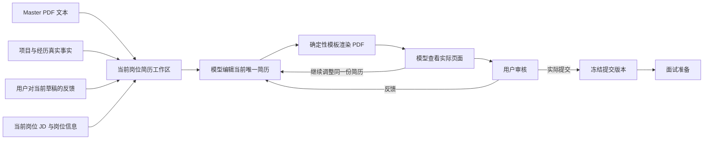

# OfferGuide 简历系统重构设计稿

状态：已实施并验收
版本：1.3
日期：2026-07-14

这是简历系统重构的唯一设计基线。旧实现、旧字段和旧测试不构成本设计的前提；只有用户确认的求职主流程、真实候选人信息、当前 JD 和最终使用效果是前提。

实现与本文冲突时，应修改实现，而不是添加兼容层保留旧概念。本文只记录仍然成立的产品决定和真实完成状态。

## D-001 最终结果

用户选中一个真实岗位后，系统完成一件完整的事：

1. 读取用户已经确认的 master 简历信息。
2. 读取该岗位完整 JD 和找岗阶段已经取得的岗位信息。
3. 读取 Project Vault 中已有的真实项目事实和用户对当前草稿的反馈。
4. 由模型编辑出该岗位唯一的一份当前简历。
5. 用确定性模板生成 PDF。
6. 模型查看实际 PDF 页面，继续调整内容强调和页面编排。
7. 用户查看并提出修改，系统继续更新同一份当前简历。
8. 用户实际提交后冻结这一份 JD、简历和投递材料。
9. 投后准备只使用被冻结的真实提交版本。

不再把“生成过一段 Markdown”“运行过一个 Skill”“通过了若干规则”视为任务完成。

## D-002 信息流是系统主干

简历系统不再由互相独立的页面、Skill 输出和临时 JSON 拼接而成。每一条信息必须有明确来源，并能进入需要它的下游环节。



任何系统已经拥有、且对当前简历有价值的信息，都不能因为入口不同而丢失。任何没有下游消费者的中间字段都不应继续存在。

## D-003 Master 简历输入

Master 输入收敛为 PDF。

- PDF 是候选人原始简历内容的来源。
- 当前阶段只从 PDF 提取文本是可接受的，因为投递 PDF 使用确定性模板重新生成。
- 不再兼容 DOCX，不再维护 DOCX 段落/表格抽取和原格式改写路径。
- PDF 原文件路径和文件哈希保留，用于知道当前内容来自哪份 master。
- 提取失败、文字缺失或乱码必须直接暴露，不能用空结构继续生成。

本条已经实施。loader 位于 `resume/master.py`；旧 `profile/` 包已整体删除。

## D-004 Master 信息不再等于半空的 UserProfile

现有 `UserProfile` 同时包含原始文本、教育、经历、技能、偏好，但实际只有原始文本被可靠填充。这种“定义了很多字段、实际信息没有流进去”的结构不再沿用。

新的 master 层应当只有两份明确内容：

1. 原始证据：PDF 提取文本和源文件身份。
2. 用户确认后的 master 语义文本：首次生成前在 apply-pack 中展示 PDF 提取结果，用户检查遗漏、乱码并可直接修正，确认后供所有岗位复用。

教育、实习、项目、技能等不是为了填数据库字段而拆分；只有当它们确实支持模型编辑、模板渲染或投后追问时才进入语义文档。

`UserProfile` 与 `profile/` 已删除。master source、PDF loader 和确认后的语义文本都归 `resume/master.py` 所有。生产代码不得自动写 `confirmed_by_user=True`；只有用户提交确认表单才会确认。

## D-005 候选人信息只能有一个汇合点

生成当前岗位简历前，系统构造一次完整的 `Resume Context`。它至少包含：

- master 语义文档；
- master PDF 提取原文，供模型回看遗漏；
- Project Vault 中与当前岗位相关的真实项目事实；
- 当前岗位完整 JD、公司、岗位名和已核验的岗位信息；
- 用户对当前草稿已经提出的修改意见；

没有生产写入口的 `user_supplements`、`references`、`omitted_materials` 已从 schema 删除，不以空字段伪装信息流。apply-pack 与 Agent tool 都调用同一个 `ResumeWorkflow` 和 Context 构造入口；自动评估不生成简历。

## D-006 不允许静默截断信息

当前的 9000/5000/4000 字符截断全部退出设计。

当前实现向简历编辑器传递完整 JD、完整 master 语义文本、当前草稿、全部 Project Vault 记录和全部反馈，不做字符串切片，也不再用固定 100 条静默截断。PDF 原文与语义文本完全相同时，模型请求只发送一份文本，数据库仍保留来源证据。

以后只有在真实数据超过所选模型容量时，才设计与 JD 有关的检索和明确的遗漏记录；在此之前不预建永远为空的 omission 字段。

## D-007 一个岗位只有一个简历工作区

用户决定推进岗位时才创建简历工作区。仅查看岗位、自动评分或 Agent 浏览岗位都不能提前生成定制简历。

工作区只保存：

- 当前岗位快照；
- 当前 master 来源；
- 当前 Resume Context；
- 当前唯一简历文档；
- 当前 PDF；
- 用户反馈和模型最近一次编辑说明；
- draft 或 submitted 状态。

用户多次调整时原地更新当前 draft，不创建互相竞争的简历版本。数据库触发器按 job 阻止第二个 workspace；每次成功更新后物理目录也只保留当前 PDF 和当前页面 PNG。

## D-008 简历编辑是核心产品服务，不是外围 Skill

简历编辑不再从多个通用 Skill/tool 入口各自调用。它应成为投递流程中的领域服务，所有入口只能请求这个服务操作当前工作区。

模型一次编辑时必须同时看到当前 JD、候选人完整上下文、当前简历和用户反馈。不能先由一个模型孤立地产生 Markdown，再由另一个不知情的流程补材料。

自动岗位评估只做找岗判断，不自动 tailor 简历。独立 `/tailor` 内容生成页和只产出建议的 `tailor_advice` 退出主流程。

## D-009 模型输出不再背负无用仪式

模型的核心输出只有：

1. 当前简历文档。
2. 给用户看的简短编辑说明。
3. 只有在本次确实加入“面试前需要补充准备”的能力声明时，才附带对应准备说明。

以下内容不再设为每次必填：

- 固定格式的 change log；
- ATS keyword used/missing；
- suggested filename；
- 固定分类的 warnings；
- 每次都生成的 actions/resources/questions/fallback；
- 为内部 schema 服务但用户不使用的字段。

模型可以解释重要编辑决定，但不为了填满 JSON 而制造信息。

## D-010 当前简历采用最小语义文档

不再让渲染器从 section 中文名称、公司后缀和日期正则猜测含义。模型直接输出一个最小的、与视觉实现解耦的文档树。

当前结构如下：

```text
ResumeDocument
  header
    lines[]
  sections[]
    title
    entries[]
      rows[]         模型按阅读顺序编排的条目抬头行
        left         主要阅读列
        right        可选，同一行靠右的紧凑日期/地点等元信息
      blocks[]
        kind         paragraph 或 bullet
        content      带局部强调的文本
      page_break_before / keep_header_with_first_block / divider_before
                     只表达模型当前明确作出的页面决定
```

这个结构不规定 section 数量、项目数量、bullet 数量、字数或页数。它只消除字符串猜测，让模型决定的内容能够无损流到模板。

## D-011 模型决定语义强调

加粗不通过冒号、bullet 开头、关键词表或固定数量决定。

模型根据当前 JD、候选人的核心贡献、阅读节奏和实际页面决定强调。强调信息直接存在 `ResumeDocument` 的富文本片段中，模板只渲染，不二次猜测。

第一次内容编辑可以提出强调；看到 PDF 后模型必须重新检查这些强调是否跨行、偏斜、过密、过少或破坏阅读流，并可直接修改。

## D-012 确定性模板的边界

模板只拥有稳定视觉语言：

- 纸张、基础边距和可读区域；
- 已确认的中英文字体体系；
- 标题、正文、日期、bullet 和分隔线的视觉样式；
- 照片是否存在时的固定位置；
- 文本不能相互遮挡等排版安全底线。

模板不拥有：

- section 含义推断；
- 公司/职位拆分；
- 哪句话应该加粗；
- 固定页数；
- 固定 bullet 数量或长度；
- 把整组项目强制粘在一页；
- 为了塞进页面而缩小或删除内容。

## D-013 分页与页面编排

渲染器先做自然排版。模型看到实际 PDF 后，可以对当前文档作出明确的编排决定，例如：

- 调整某段内容的展开或压缩；
- 调整经历顺序；
- 改变局部强调；
- 在合适的语义边界显式分页；
- 指定标题与第一条内容不要分离。

这些决定属于当前岗位、当前内容，不升级成全局规则。模板不再使用 `sticky: not final` 一类把整个项目捆绑的固定逻辑。

## D-014 模型必须查看最终页面

生成 Typst PDF 后，系统同时得到逐页图片和基础页面信息。视觉审阅模型的输入包括：

- 实际页面图片；
- 当前 ResumeDocument；
- 当前 JD 和核心候选人上下文；
- 用户最近的视觉反馈。

模型直接判断页面是否清楚、平衡、自然，不能用“没有坐标重叠”替代视觉判断。

文字重叠、字体缺失、PDF 编译失败仍由代码直接阻止；美感、强调和阅读节奏由模型查看页面决定。

## D-015 视觉审阅后仍修改同一份简历

视觉审阅不是生成第二套候选简历。模型返回修改后，系统重新渲染并再次把新页面交给模型。只有模型对与当前 document 匹配的 PDF 不再提出修改，才标记 `reviewed` 并覆盖 draft；未收敛或中途失败时保留上一份完整草稿。

视觉审阅可以修改内容和编排，因为有时大空白、断裂和密度问题来自内容组织，而不是间距参数。所有改动仍受候选人事实和当前 JD 约束。

用户始终看到一份最新 PDF，可以继续说“这一段不对”“这里太空”“加粗不自然”，模型带着完整上下文继续修改。

## D-016 用户审核界面

投递包页面以当前 PDF 为中心，而不是以 raw Markdown、change log 和内部字段为中心。

页面需要具备：

- 直接查看当前 PDF；
- 查看当前 JD；
- 向模型提出本次简历修改意见；
- 触发模型重新编辑并重新审阅 PDF；
- 查看本次确实新增、需要面试前准备的能力声明；
- 明确的“我已经实际提交”动作。

不再需要单独 `/tailor` 页面和“复制 Markdown”作为主工作流。

## D-017 提交冻结

用户点击“已经实际提交”后，系统冻结：

- 当时的 JD；
- 当时的 ResumeDocument；
- 实际 PDF 文件及哈希；
- 实际投递话术和网申回答；
- 本次新增能力声明及准备说明。

冻结后不再被 master 更新、模板更新或模型重写覆盖。用户如果明确说明实际提交了另一份文件，需要作为一次显式纠正操作记录，而不是静默替换。

## D-018 投后信息继续流动

真实面经问答读取冻结版本，而不是重新读取 master 或重新猜测用户投了什么。

它应直接得到：

- 冻结 JD；
- 冻结简历全文；
- 简历中的项目和能力声明；
- Project Vault 的对应深层事实；
- 投递时新增且需要补齐的知识；

Research 阶段只使用冻结 JD 搜索工作内容相似的真实面经；隔离的 Writer 再使用上述候选人事实回答原帖中实际出现的问题。简历编辑阶段产生的事实与表达边界必须流到 Writer，但不能进入对外搜索查询。

## D-019 旧实现的处理结果

本轮没有在旧链路外再套一层新入口，而是直接替换其所有权边界：

- 半填充 `UserProfile` 和整个 `profile/` 包已删除；PDF master 归入 `resume/master.py`。
- `skills/tailor_resume/`、`analyze_gaps/`、`successful_profile/`、`profile_resume_gap/`、`resume_quality.py`、`application_artifacts.py`、`application_snapshots.py` 已删除，不保留兼容别名。
- 模型编辑集中在 `resume/editor.py`，上下文只从 `resume/context.py` 构造。
- `ResumeDocument` 直接绑定唯一 `engineering_resume.typ`，渲染器不再猜 section、公司、日期或加粗。
- `save_draft` 是唯一 draft 写入口，一次原子写入 Context、ResumeDocument、PDF 与投递包；失败不落空 workspace，也不覆盖旧稿。
- 每个 job 只能有一个 `resume_workspaces` 行；draft 原地更新，submitted 由数据库触发器阻止修改与删除。
- `/tailor`、独立 `/apply` 和自动 tailor 路径已删除；`/jobs/{job_id}/apply-pack` 是唯一用户入口。
- Web、`InterviewResearchAgent` 和 Mock 都只读取已冻结 workspace；不再从当前 master、live JD 或历史 skill run 猜测。
- `write_cover_letter` 独立 Skill/打印路由、旧兼容评分字段，以及固定 7/14/30 天投后提醒系统已删除。
- 固定五步、三字段的 `ApplicationPlan` 已删除；apply-pack 只展示真实岗位链接、当前 PDF、模型投递材料和实际提交动作。
- 简历服务、`JobDiscoveryAgent`、`InterviewResearchAgent` 和主对话 Agent 都读取用户确认后的 master 语义文本，不再各自绕回 PDF 原始抽取文本。
- 没有生产来源的 visual reference 参数已删除；已确认的视觉语言只存在于唯一 Typst 模板中。

## D-020 已删除的旧概念

以下概念不进入新系统：

- DOCX 原格式改写；
- 独立 Tailor 工作台；
- 自动评估岗位时顺便生成简历；
- 多个入口各自调用同一个 Skill；
- successful profile 是否存在决定不同入口拿到不同输入；
- 强制 change log、ATS 字段和固定准备计划；
- section alias、公司后缀和日期正则驱动排版；
- flat section、整组 sticky、固定 bullet 规则；
- 模板刷新后不看页面就自动认定排版完成；
- 只有测试和坐标检查、没有实际页面审阅。

## D-021 实施状态

完整链路已经实施：

1. [x] 新的 master source、master semantic document 和 Resume Context。
2. [x] 唯一 ResumeDocument 与简历工作区。
3. [x] 统一简历编辑服务和完整上下文入口。
4. [x] 直接绑定 ResumeDocument 的 Typst renderer。
5. [x] 逐页 PNG 和可选多模态视觉审阅；当前文本模型不支持图片时明确记录 unavailable，不伪装成已审阅。
6. [x] 以 PDF、JD 和反馈修改为中心的 apply-pack。
7. [x] 同事务提交冻结与投后读取。
8. [x] job#10 已迁移到新 workspace，并人工查看实际页面。
9. [x] 旧入口、旧 schema、旧 Skill、旧模板适配器已删除。
10. [x] 清除旧测试、旧说明、错误运行记忆和孤儿渲染产物。
11. [x] Agent 已接入同一 `prepare_application`、`revise_application`、`rerender_application` 服务。
12. [x] 完成最终全量回归和真实浏览器验收。

每一步都必须让真实信息流更完整；不以新增文件数量、字段数量或测试数量作为完成标准。

## D-022 已确认的核心选择

以下内容已经由用户确认，不再作为待选项反复讨论：

1. master 输入只支持 PDF。
2. 删除半填充 `UserProfile`，建立 master 来源和语义文档。
3. 删除独立 `/tailor` 和自动 tailor，apply-pack 成为唯一入口。
4. 模型看到实际页面后可以调整强调、分页和内容组织，但模板更新本身只重新排版，不调用模型改内容。
5. 用最小 ResumeDocument 替代 Markdown 与正则推断。
6. 照片只在 master PDF 中确实存在且能够可靠提取时沿用。
7. 只有实际新增可准备能力时记录 preparation note。

## D-023 本轮清理边界

- master loader 已收敛为 PDF-only。
- 旧 `profile/`、独立 cover-letter、旧 apply schema 及其页面已删除。
- 已移除 `python-docx` 直接依赖。
- 已删除仓库根 `CLAUDE.md`。
- 已删除受版本控制的 `.claude` instructions、settings 和 hooks。
- `AGENTS.md` 保留，作为用户当前明确提供的唯一仓库工作守则。
- 已删除旧 DOCX dogfood 示例、过时真实周期脚本，以及整组 2026-05-11 阶段 dogfood 日志。
- 已删除旧竞品结论、UX 实施清单、找岗调研和 tracking 状态备忘录；它们不再作为新设计依据。
- 真实数据库中旧 resume skill runs、错误 follow-through signals 和 job#10 旧分析链 events 已删除；worldview 不再引用 `application_snapshots`。
- 旧 draft 投递包只做确定性字段迁移，不重新调用模型；当前 workspace、PDF 和内容保持不变。
- 旧 `apply_assistant` v0.2 runs、当前草稿中对 `self_intro_snippet` 的无效引用，以及 SQLite schema 中的 `tailor_resume` 脏注释已删除。
- 浏览器扩展直接读取当前 workspace；同一公司存在多个岗位时要求用户选择具体 job，不猜测也不串包。

旧测试不能要求恢复上述概念。旧说明如果仍描述这些路径，应删除或按当前实现重写，不能继续充当开发依据。

## D-024 最终验收记录

2026-07-13 的最终验收结果：

- 全量测试：`797 passed, 2 skipped`；跳过项分别需要本机样例 PDF 和显式开启真实网络测试。
- Ruff 通过；Pyright `src` 为 0 errors；`git diff --check` 通过；扩展三个 JavaScript 文件语法检查通过。
- `GET /jobs/10/apply-pack` 返回 200；页面只显示当前简历、完整 JD、修改入口、投递话术/回答/检查和实际提交动作。
- 当前 PDF API 返回 200，SHA-256 为 `44a8a375c0aebdcd6953bc70adcd9443720adae3d218be69d1421e53eaf5cae8`，与 workspace 一致。
- 已人工查看当前 PDF 的实际页面图片，未见文字遮挡；当前 workspace 明确记录 `not_run_after_rerender`，不声称视觉模型审阅过模板重排后的最终页。
- `/tailor`、`/apply`、`/profile/...` 和旧 snapshot API 均返回 404。
- 对尚无申请的 job#1 执行 GET 前后，application/workspace 数量不变，没有读操作隐式建稿。
- 当前运行库只有 application#1 / workspace#1 / job#10 的一份 draft，旧字段引用和旧 apply skill runs 均为 0；PDF 文件和哈希未被清理过程改写。
